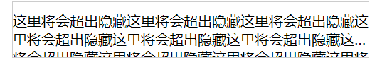

<!-- START doctoc -->

<!-- END doctoc -->

# 👏js相关

## 👀基础

### 1.js单线程,为什么？

js单线程，原因避免dom渲染冲突

### 2.js数据类型？

- 基本类型：Undefined，Boolean，String，Number，Null，Symbol,BigInt

- 引用类型：Object (Array,Date,RegExp,Function)

### 3.创建对象的几种方式？

```javascript
var o1 = {name:'abcd01'};
var o2 = new Object({name:'abcdo2'});
function M(name) {
    this.name=name;
}
var o3 = new M('abcdo3');
var p={name:'abcdp'};
var o4 = Object.create(p);
// ps:o4创建了一个原型，o4.__proto__===p
```

### 4.new操作符具体干了什么呢?

（1）创建一个空对象，并且 this 变量引用该对象，同时还继承了该函数的原型。

（2）属性和方法被加入到 this 引用的对象中。

（3）新创建的对象由 this 所引用，并且最后隐式的返回 this 。

### 5.DOM事件类

捕获、冒泡和自定义事件。

当一个事件触发时是先从上到下触发对应的事件监听器，再冒泡去触发对应的事件监听器。

- 捕获（上到下）顺序 `window=>document=>html(document.documentElement获得html标签)>body>...`

```javascript
dom.addEventListener('click',function () { //dom为上一行捕获的对象
    console.log(123);//上一行每一个对象所捕获
},true); //为true才可以捕获
```

- 冒泡（下到上）和上面相反
  
  - Event对象常见应用：

```javascript
event.preventDefault();

event.stopPropagation();

event.stopImmediatePropagation() ; //一个对象有多个事件，添加这句话，其他的不会在执行

event.currentTarget； //当前所绑定的事件，父级对象

event.target
```

- 自定义事件

```javascript
//var eve = new Event('custome');

    //var eve = new Event('custome');
    var eve = new CustomEvent('custome', {
        detail: {
            username: "davidwalsh"
        }
        });//可以增加参数
    dom.addEventListener('custome',function (e) {
        console.log(e.detail)
    });
        dom.dispatchEvent(eve);//触发自定义事件
```

### 6. for in 与 for of 的区别

**for in**

- 首先，for in 就是用来遍历对象属性用的，遍历数组等最好不要使用，它的效率比较低

- for in 遍历对象属性是会进行原型链搜索，因此继承的属性也会被遍历到，如果不想遍历继承的属性和方法可以使用 `hasOwnProperty()`方法判断该属性是否该对象的实例属性。

- for in 执行过程
  
  - 判断in后的表达式结果
    
    - undefined或null则报错或跳过
    - 数字、字符串或布尔值转换为包装对象
  
  - 运行in前面的表达式，从后面的对象取属性赋值给该结果（左值）
  
  - 执行循环体
  
  - 重复前面2个步骤
    
    ```js
    // 利用这个特性，可以将对象属性拷贝到数组
    let obj = {
      name: 'zs',
      age: 20
    }
    let a = []
    let i = 0
    for (a[i++] in obj);
    console.log(a)
    // [ 'name', 'age' ]
    ```

- for in 遍历数组得到的是数组各项的索引，是字符串类型的

**for of**

- 这是ES6新增的，它遍历数组内的元素，不包括原型和索引
- 可以遍历数/数组对象/字符串/map/set等拥有迭代器对象（iterator）的集合，但是**不能遍历对象，因为对象不含迭代器对象。**

**总结**

| 类型  | for in    | for of          |
|:---:|:---------:|:---------------:|
| 数组  | 索引（字符串类型） | 值               |
| 字符串 | 索引（字符串类型） | 值               |
| 对象  | 属性（字符串类型） | 报错              |
| 数字  | 不报错但拿不到值  | 报错              |
| Set | 不报错但拿不到值  | 值               |
| Map | 不报错但拿不到值  | 各项['key','val'] |

- for of 不能遍历对象和数字，其他都能拿到值，其中Map拿到的是数组

- for in 都可以遍历，但只有数组、字符串和对象能拿到属性（索引）

## 👀核心

### 1.闭包及其应用 ？

[【JavaScript修炼】闭包和虽死犹存的函数](https://blog.csdn.net/laplacepoisson/article/details/124662698)

### 2.谈谈javascript作用域链？

 [【JavaScript修炼】变量对象与作用域链_前端corner的博客-CSDN博客](https://blog.csdn.net/laplacepoisson/article/details/124658971)

当执行一段JavaScript代码（全局代码或函数）时，JavaScript引擎会创建为其创建一个执行上下文（Execution Context），在页面加载后会首先创建一个全局的执行上下文，每遇到函数调用就会创建一个执行上下文并压入执行上下文栈中。作用域链的作用是用于解析标识符，当执行上下文被创建后，js引擎进入执行上下文，用arguments、命名参数和该函数中的所有局部变量创建一个变量对象，然后激活对象，将变量对象添加到当前的执行上下文中。然后利用函数内部的[[Scopes]]属性初始化作用域链，将当前执行上下文的激活对象添加到作用域链的最前端。

函数的[[Scopes]]属性是在函数定义时就确定的，因为javascript的作用域是词法作用域。

### 3.如何理解JavaScript原型链？

JavaScript中的每个对象都有一个prototype属性，我们称之为原型，而原型的值也是一个对象，因此它也有自己的原型，这样就串联起来了一条原型链，原型链的链头是Object,它的prototype比较特殊，值为null。

原型链的作用是用于对象继承，函数A的原型属性(prototype property)是一个对象，当这个函数被用作构造函数来创建实例时，该函数的原型属性将被作为原型赋值给所有对象实例，比如我们新建一个数组，数组的方法便从数组的原型上继承而来。

当访问对象的一个属性时, 首先查找对象本身, 找到则返回; 若未找到, 则继续查找其原型对象的属性(如果还找不到实际上还会沿着原型链向上查找, 直至到根). 只要没有被覆盖的话, 对象原型的属性就能在所有的实例中找到，若整个原型链未找到则返回undefined。

### 4. 如何确定this的指向？

一般this就是调用函数的对象。

要确定this的指向，首先得知道什么是MemberExpression.

- - PrimaryExpression // 原始表达式 可以参见《JavaScript权威指南第四章
  
  - FunctionExpression // 函数定义表达式
  
  - MemberExpression [ Expression ] // 属性访问表达式
  
  - MemberExpression . IdentifierName // 属性访问表达式
  
  - new MemberExpression Arguments // 对象创建表达式

- 确定this的关键是先计算 MemberExpression 得到ref，然后判断ref是否为一个Reference。

- **属性访问表达式**返回Reference,例如`foo.bar`

- 括号并不会调用括号内的reference的GetVlue，如`(foo.bar)`

- **赋值（“=”）操作符**、**二元逻辑运算符（“||”）**、**逗号操作符**计算算得到的ref是调用GetValue得到的值，所以结果不是Reference，如`(foo.bar = foo.bar)`

- getBase得到的值只可能是 undefined, an Object, a Boolean, a String, a Number, 和 an environment record 中的一种。

**只有当ref既是Reference又是一个对象的时候，this的值是调用getBase得到的结果，否则this都为undefined,只不过在非严格模式下，undefined会被隐式转换为全局对象。最常见的计算结果为Reference的MemberExpression就是属性访问表达式了。这也就是为什么我们常说this就是调用函数的对象。****

### 5. 说一说IIFE

- IIFE就是立即调用的函数表达式。

- 可以像下面这样调用它
  
  - `(function(){})()`
  
  - `(function(){}())`

- 或者是像下面这样，将圆括号左侧变为一个表达式，也可以调用它：
  
  - `var i = function(){}()`
  
  - `!function(){}()`
  
  - `true && function(){}()`

- 立即执行函数的应用：
  
  - 可以保存闭包状态
  
  - 使用模块化的写法避免全局变量的污染

## 👀ES6

### 1.class

es6的class其实就是个语法糖，babel转出来的依旧是寄生组合式继承。 具体的使用没有太多的可以说的，需要注意super即可以当函数，也可以实例。这部分不做细说，因为很复杂，有兴趣参考[es6 Class的继承](http://es6.ruanyifeng.com/#docs/class-extends#super-%E5%85%B3%E9%94%AE%E5%AD%97)。  
需要注意的是，**ES5的继承，实质是先创造子类的实例对象this，然后再将父类的方法添加到this上面（Parent.apply(this)）。ES6 的继承机制完全不同，实质是先创造父类的实例对象this（所以必须先调用super方法），然后再用子类的构造函数修改this。**

## 👀DOM

### 1.直接绑定和事件监听有哪些区别？

- 直接绑定对于一个事件只能有**一个处理函数**，再次绑定会覆盖处理函数。事件监听对于同一事件可以有**多个处理函数。**
- 只有**html元素、document对象，window对象**可以使用直接绑定；监听器除那三个还可以是**任何其他支持事件的对象**，如[XMLHttpRequest](https://developer.mozilla.org/zh-CN/docs/Web/API/XMLHttpRequest).
- 事件监听可以通过第三个参数（配置对象Options或布尔值useCapture,默认为false）**指定事件监听器的触发阶段（冒泡或捕获）。**

补充：

- click 事件的运行顺序在 [mousedown](https://developer.mozilla.org/zh-CN/docs/Web/API/Element/mousedown_event) 和 [mouseup](https://developer.mozilla.org/zh-CN/docs/Web/API/Element/mouseup_event) 事件之后。
- [mdn关于兼容性的封装](https://developer.mozilla.org/zh-CN/docs/Web/API/EventTarget/addEventListener#%E5%85%BC%E5%AE%B9%E6%80%A7)

### 2.节流(throttle)防抖 (debounce)

- debounce: 事件触发时，相应函数延迟一会才执行。当密集触发时函数执行会被一直延迟。应用：输入框发送请求。
- throttle: 事件触发时，节流函数会按照一定频率执行事件处理函数。

[手撕源码系列 —— lodash 的 debounce 与 throttle](https://zhuanlan.zhihu.com/p/91110334)

### 3. 事件委托

事件委托利用了冒泡的特点，举个例子，如果想要在大量子元素中单击任何一个都可以运行一段代码，您可以**将事件监听器设置在其父节点**上，**并让子节点上发生的事件冒泡到父节点上，而不是每个子节点单独设置事件监听器。**

先捕获后冒泡。

****

# 👏框架

## 👀Vue

### 1. vue组件通信方式？

[官方文档事件总线](https://v3.cn.vuejs.org/guide/migration/events-api.html#%E4%BA%8B%E4%BB%B6%E6%80%BB%E7%BA%BF)

**总述：一共有7、8种方式**

- props
- \$emit / \$on
- \$children / \$parent
- \$attrs / $listeners
- ref
- $root
- eventbus
- vuex

其中在vue3中\$on/\$parent/$listeners这些api已经被废除

事件api的废除使得eventbus实现起来不是很方便，可以通过引入第三方实现了事件触发器接口的库，例如 [mitt](https://github.com/developit/mitt) 或 [tiny-emitter](https://github.com/scottcorgan/tiny-emitter)。

\$children的替代可以使用$refs。

\$listeners废弃后直接通过$attrs就可以访问添加在组件上的事件监听器。

**根据组件关系阐述**

- **父子组件**

- props / emit / $parent / ref / $attrs(爷孙之间透穿属性)

- **兄弟组件**

- $parent / $root / eventbus / vuex

- **跨层级组件**

- vuex / eventbus / provide / inject

### 2. v-if 和 v-for 哪个优先级高？

思路

- 结论
- 为什么，细节
- 场景
- 总结拔高

这个问题在官方文档中其实有[详细描述](https://cn.vuejs.org/v2/style-guide/#%E9%81%BF%E5%85%8D-v-if-%E5%92%8C-v-for-%E7%94%A8%E5%9C%A8%E4%B8%80%E8%B5%B7%E5%BF%85%E8%A6%81)。

1. 在vue2中，v-for的优先级高于v-if。而vue3中，v-if的优先级高于v-for。
2. 一般有两种情况可能会这样做
- 为了过滤一个列表中的项目，`v-for="user in users" v-if="user.isActive"`，推荐直接使用计算属性做列表过滤。
- 为了避免渲染本应该被隐藏的列表，`v-for="user in users" v-if="shouldShowUsers"`，这种情况应该把`v-if`放到父容器上。
3. 平时在实践中一定要避免v-for和v-if同时出现在一个元素上。
4. 在vue2中，两者放在一起输出的渲染函数是先执行循环，在循环里判段；vue3中是先判断再决定是否循环。

```javascript
// vue3
return function render(_ctx, _cache) {
  with (_ctx) {
    const { createCommentVNode: _createCommentVNode, renderList: _renderList, Fragment: _Fragment, openBlock: _openBlock, createElementBlock: _createElementBlock, toDisplayString: _toDisplayString, createElementVNode: _createElementVNode } = _Vue
    return (_openBlock(), _createElementBlock(_Fragment, null, [
      _createCommentVNode(" 过滤列表中项目 "),
      _createCommentVNode(" 过滤列表中项目 "),
      _createCommentVNode(" 浏览器控制台会报错：Uncaught TypeError: Cannot read properties of undefined (reading 'isActive') "),
      _createCommentVNode(" <div id=\"app\">\n      <div v-for=\"item in items\" :key=\"item.id\" v-if=\"item.isActive\">\n        {{ item.name }}\n      </div>\n    </div> "),
      _createCommentVNode(" 避免渲染应该被隐藏的列表 "),
      _createElementVNode("div", _hoisted_1, [
        shouldShowUsers
          ? (_openBlock(true), _createElementBlock(_Fragment, { key: 0 }, _renderList(items, (item) => {
              return (_openBlock(), _createElementBlock("div", { key: item.id }, _toDisplayString(item.name), 1 /* TEXT */))
            }), 128 /* KEYED_FRAGMENT */))
          : _createCommentVNode("v-if", true)
      ])
    ], 2112 /* STABLE_FRAGMENT, DEV_ROOT_FRAGMENT */))
  }
}
// vue2
(function anonymous(
) {
with(this){return _c('div',{attrs:{"id":"app"}},[_c('div',{attrs:{"id":"app"}},_l((items),function(item){return (shouldShowUsers)?_c('div',{key:item.id},[_v("\n        "+_s(item.name)+"\n      ")]):_e()}),0)])}
})
```

### 3.[面试官：说说你对vue的理解? ](https://github.com/febobo/web-interview/issues/1)

- vue是什么？
  
  - Vue.js（/vjuː/，或简称为Vue）是一个用于创建用户界面的开源JavaScript框架，也是一个创建**单页应用**的Web应用框架。
  
  - Vue所关注的核心是MVC模式中的**视图层**，同时，它也能方便地**获取数据更新**，并通过组件内部特定的方法实现视图与模型的交互

- vue的核心特性：
  
  - 数据驱动MVVM：三层
  
  - 指令系统
    
    - 带有 v- 前缀的特殊属性作用：当表达式的值改变时，将其产生的连带影响，响应式地作用于 DOM
    
    - 常用的指令
  
  - 组件化
    
    - 把图形、非图形的各种逻辑均抽象为一个统一的概念（组件）来实现开发的模式
    
    - 降低整个系统的耦合度
    
    - 调试方便
    
    - 提高可维护性

- vue与传统开发区别：
  
  - vue通过操作数据来操作界面事件，不操作DOM
  
  - DOM的变化是数据变化导致的，即DOM与数据绑定。

### 4.[面试官：Vue3.0的设计目标是什么？做了哪些优化?](https://github.com/febobo/web-interview/issues/45)

更小、更快、更友好、优化方案。

- 更小
  
  - `Vue3`移除一些不常用的 `API`
  
  - 引入`tree-shaking`，可以将无用模块“剪辑”，仅打包需要的，使打包的整体体积变小了

- 更快：主要体现在编译方面：
  
  - diff算法优化
  - 静态提升
  - 事件监听缓存
  - SSR优化

- 更友好：composition API
  
  - 很多类似的第三方库，我们只需要调用即可，不必关注实现过程，开发效率大大提高.
  
  - `VUE3`是基于`typescipt`编写的，可以享受到自动的类型定义提示

- 优化方案
  
  - `vue3`从很多层面都做了优化，可以分成三个方面：
    
    - 源码
    - 性能
    - 语法 API
  
  - 源码
    
    - 将不同的模块拆分到`packages` 目录下面不同的子目录中，使得模块拆分更细化，职责划分更明确，模块之间的依赖关系也更加明确，开发人员也更容易阅读、理解和更改所有模块源码，提高代码的可维护性
    
    - 一些 `package`（比如 `reactivity` 响应式库）是可以独立于 `Vue` 使用的
  
  - 性能
    
    - 体积优化
    
    - 编译优化
    
    - 数据劫持优化

# 👏浏览器

## 1.你知道哪些跨页面通信的方式呢？

[面试官：前端跨页面通信，你知道哪些方法？ - 掘金](https://juejin.cn/post/6844903811232825357)

- 广播模式：Broadcast Channe / Service Worker / LocalStorage + StorageEvent
- 共享存储模式：Shared Worker / IndexedDB / cookie
- 口口相传模式：window.open + window.opener
- 基于服务端：Websocket / Comet / SSE 等

**同源页面**

- **Broadcast Channel**
  
  - 它允许同源的不同浏览器窗口，Tab页，frame或者 iframe 下的不同文档之间相互通信。
  
  ```javascript
  var bc = new BroadcastChannel('internal_notification');
  bc.postMessage('New listening connected!');
  ```

- **Service Worker**

    在 Service Worker 中监听了`message`事件，获取页面（从 Service Worker 的角度叫 client）发送的信息。然后通过`self.clients.matchAll()`获取当前注册了该 Service Worker 的所有页面，通过调用每个client（即页面）的`postMessage`方法，向页面发送消息。这样就把从一处（某个Tab页面）收到的消息通知给了其他页面。

- **LocalStorage**

当前页面使用的storage被其他页面修改时会触发StorageEvent事件，该事件对象上有5个只读的属性：`key newValue oldValue storageArea url`

- **Shared Worker**

- **IndexedDB**

- **window.open + window.opener**

**非同源页面**

- **iframe**

使用一个用户不可见的 **iframe **作为“桥”。由于 iframe 与父页面间可以通过指定`origin`来忽略同源限制，因此可以在每个页面中嵌入一个 iframe （例如：`http://sample.com/bridge.html`），而这些 iframe 由于使用的是一个 url，因此属于同源页面，其通信方式可以复用上面第一部分提到的各种方式。

### 2. 浏览器加载白屏是什么原因？

- 请求发出前可能有：
  
  - 资源不合法，如跨域，https 用 http 等等，csp 等等
  
  - 请求队列太多或者本资源优先级不够高，资源被 delay
  
  - dns 出问题，劫持，自己开了代理，dns 服务器挂了等等

- 请求发送过程中可能有：
  
  - 没有到达服务器，如 cdn 挂了
  
  - 到达服务器但是没有到达处理程序，如在队列里堆积，403，401 等等
  
  - 到达了处理程序，但 500 了（假设 500 也算白屏的话，因为可能有只是 catch 了错误，啥也没干）
  
  - 成功运行，但是迟迟没有返回，如代码本身耗时久，死循环，rpc 慢等等

- 请求返回之后可能有：
  
  - 解析阶段跪了，如要 json 返回了一段 text，json/js 不合规范等等
  
  - 执行阶段跪了，如 render 挂了（假设没有针对这一情况做处理，那么就白屏了），死循环，也有可能是纯粹代码写错了，比如 data 写成了 date，css 写错比如设置了 display：none 等等

- 其它：
  
  - 突然断网了
  
  - 客户端的锅

- Roast:

这个题分阶段阐述更为清晰，笼统的讲述容易有所遗漏。 思考时，需要考虑到用户环境、前端部署、后端服务三个方面的内容。

### 3. 如何理解重排和重绘？

1. 重排和重绘是浏览器关键渲染路径上的两个节点， 浏览器的关键渲染路径就是 DOM 和 CSSOM 生成渲染树，然后根据渲染树通过一个布局(也叫 layout)步骤来确定页面上所有内容的大小和位置，确定布局后，将像素 绘制 (也叫 Paint)到屏幕上。

2. 其中重排就是当元素的**位置发生变动**的时候，浏览器重新执行布局这个步骤，来重新确定页面上内容的大小和位置，确定完之后就会进行重新绘制到屏幕上，所以**重排一定会导致重绘。**

3. 如果元素位置没有发生变动，仅仅只是**样式发生变动**，这个时候浏览器重新渲染的时候会**跳过布局步骤，直接进入绘制步骤**，这就是重绘，所以**重绘不一定会导致重排。**

**这道题一般考察两个点：**

1. **浏览器的关键渲染路径**。如果答不到这上面，一般这个题就凉了。
2. 性能优化，如果减少重绘和回流，当然这个点肯定也是要基于对 **关键渲染路径** 的理解（这点不是关键点）。

参考文章： [【面试系列一】如何回答如何理解重排和重绘](https://segmentfault.com/a/1190000041554442)

# 👏前端工程化

## 👀Webpack

### 1.babel的转译过程？以ES6代码转译为ES5代码为例。

1. ES6代码输入。

2. babylon进行解析得到AST。

3. plugin用babel-traverse遍历AST转译，得到新的AST树。

4. 用babel-generator通过AST树生成ES5代码。

### 2.babel如何处理async错误捕获转换的？

### 3. 什么是模块化？

- 模块化就是为了减少系统耦合度，提高内聚，减少资源循环依赖，增强系统框架设计。
- 让开发者便于维护,同时也让逻辑相同的部分可复用
- 模块化开发：针对js、css，以**功能**或**业务**为单元组织代码。js方面解决独立作用域、依赖管理、api暴露、按需加载与执行、安全合并等问题，css方面解决依赖管理、组件内部样式管理等问题。

### 4. 谈谈你对webpack的看法

本质上，**webpack** 是一个用于现代 JavaScript 应用程序的 *静态模块打包工具*。

当 webpack 处理应用程序时，它会在内部从一个或多个入口点构建一个 依赖图，然后将你项目中所需的每一个模块组合成一个或多个 *bundles*，它们均为静态资源，用于展示你的内容。

它可以很好地管理、打包开发中所用到的HTML,CSS,JavaScript和静态文件（图片，字体）等

### 5. webpack的基本功能和工作原理？

基本功能：

- 代码转换：TypeScript 编译成 JavaScript、SCSS 编译成 CSS 等等。
- 文件优化：压缩 JavaScript、CSS、HTML 代码，压缩合并图片等。
- 代码分割：提取多个页面的公共代码、提取首屏不需要执行部分的代码让其异步加载
- 模块合并：在采用模块化的项目有很多模块和文件，需要构建功能把模块分类合并成一个文件。
- 自动刷新：监听本地源代码的变化，自动构建，刷新浏览器
- 代码校验：在代码被提交到仓库前需要检测代码是否符合规范，以及单元测试是否通过
- 自动发布：更新完代码后，自动构建出线上发布代码并传输给发布系统。

构建过程：

- 从entry里配置的module开始递归解析entry依赖的所有module
- 每找到一个module，就会根据配置的loader去找对应的转换规则
- 对module进行转换后，再解析出当前module依赖的module
- 这些模块会以entry为单位分组，一个entry和其所有import的module被分到一个组initial-chunk，而动态导入的module则分到另外一个组non-chunk
- 最后webpack会把所有Chunk转换成文件输出
- 在整个流程中webpack会在恰当的时机执行plugin里定义的逻辑

打包原理

- 将所有依赖打包成一个bundle.js，通过代码分割成单元片段按需加载

### 6. webpack使用的代码压缩库是？

[terser](https://github.com/terser/terser)

### 7. 什么是bundle,chunk,module?

可以查看[术语表](https://webpack.docschina.org/glossary/#a)

- bundle 由许多不同的模块生成，包含已经经过加载和编译过程的源文件的最终版本。

- chunk是webpack的特定术语，在内部用于管理捆绑过程，也可以理解为webpack在进行模块的依赖分析的时候，代码分割出来的代码块。

- module是开发中的单个模块，在webpack中一个文件就是一个模块。

### 8. treeShaking原理？

treeShaking就是移除 JavaScript 上下文中的未引用代码(dead-code)，它依赖于 ES2015 模块语法的 [静态结构](http://exploringjs.com/es6/ch_modules.html#static-module-structure) 特性，例如 `import` 和 `export`

## 👀Git

### 1.了解常见的commit的命名规范吗？

```javascript
 'feat', // 新功能 feature：产品、技术需求、技术优化等功能开发
 'fix', // 一个错误修复
 'refactor', // 重构(既不增加新功能，也不是修复bug)
 'docs', // 仅文档更改
 'test', // 添加缺失的测试或更正现有的测试
 'chore', // 文档、辅助工具等的修改
 'style', // 不影响代码含义的更改（空白，格式，缺少分号等）
 'perf', // 改进性能的代码更改
 'revert', // 回退

 // eg: 'feat: 添加了图表功能'
```

# 👏网络

### 1. 谈谈cookie, sessionStorage 和localStorage之间的区别.

- `localStorage` **持久化**的本地存储，除非主动删除数据，否则数据是永远不会过期的。

- `sessionStorage` 不是一种持久化的本地存储，仅仅是**会话级别的存储**

- `cookie` Web Storage的概念和cookie相似，区别是它是为了更大容量 存储设计的。 HTTP协议是无状态的协议。一旦数据交换完毕，客户端与服务器端的连接就会关 闭，再次交换数据需要建立新的连接。这就意味着服务器无法从连接上跟踪会话， `Cookie`就是这样的一种机制。它可以弥补`HTTP`协议无状态的不足。在Session出现之前 ，基本上所有的网站都采用Cookie来跟踪会话。Cookie实际上是一小段的文本信息。客 户端请求服务器，如果服务器需要记录该用户状态，就使用response向客户端浏览器颁 发一个Cookie。客户端浏览器会把Cookie保存起来。当浏览器再请求该网站时，浏览 器把请求的网址连同该Cookie一同提交给服务器。服务器检查该Cookie，以此来辨认用户状态 。服务器还可以根据需要修改Cookie的内容。 Cookie的大小是受限的，并且每次你请求 一个新的页面的时候Cookie都会被发送过去，这样无形中浪费了带宽，另外cookie还需要 指定作用域，不可以跨域调用。Cookie在客户端是由浏览器来管理的，浏览器能够保证 Google只会操作Google的Cookie而不会操作Baidu的Cookie，从而保证用户的隐私安 全。 除此之外，Web Storage拥有setItem,getItem,removeItem,clear等方法， 不像cookie需要前端开发者自己封装setCookie，getCookie。 但是 **Cookie也是不可 以或缺的：Cookie的作用是与服务器进行交互，作为HTTP规范的一部分而存在 ，而 Web Storage仅仅是为了在本地“存储”数据而生**

### 2.HTTP的特点有哪一些？

- 简单快速 ：客户向服务器请求服务时，只需传送请求方法和路径。请求方法常用的有GET、HEAD、POST。每种方法规定了客户与服务器联系的类型不同。由于HTTP协议简单，使得HTTP服务器的程序规模小，因而通信速度很快。
- 灵活：HTTP允许传输任意类型的数据对象。正在传输的类型由Content-Type加以标记
- 无连接： 无连接的含义是限制每次连接只处理一个请求。服务器处理完客户的请求，并收到客户的应答后，即断开连接。采用这种方式可以节省传输时间。
- 无状态：HTTP协议是无状态协议。无状态是指协议对于事务处理没有记忆能力。缺少状态意味着如果后续处理需要前面的信息，则它必须重传，这样可能导致每次连接传送的数据量增大。另一方面，在服务器不需要先前信息时它的应答就较快。

### 3.HTTP请求方法有哪一些？

- GET 请求指定的页面信息，并返回实体主体。
- HEAD 类似于get请求，只不过返回的**响应中没有具体的内容**，用于获取报头。
- POST 向指定资源提交数据进行处理请求（例如提交表单或者上传文件）。数据被包含在请求体中。POST请求可能会导致新的资源的建立和/或已有资源的修改。
- PUT 从客户端向服务器传送的数据取代指定的文档的内容。
- DELETE 请求服务器删除指定的页面。
- CONNECT HTTP/1.1协议中预留给能够将连接改为**管道方式**的代理服务器。
- OPTIONS 允许客户端查看**服务器的性能**或支持的方法。
- TRACE 回显服务器收到的请求，主要用于**测试或诊断。**

### 4.HTTP状态码有哪一些？

- 1xx：指示信息--表示请求已接收，继续处理
- 2xx：成功--表示请求已被成功接收、理解、接受
- 3xx：重定向--要完成请求必须进行更进一步的操作
- 4xx：客户端错误--请求有语法错误或请求无法实现
- 5xx：服务器端错误--服务器未能实现合法的请求

### 5.知道持久连接与管线化吗？

- 持久连接
  
  什么是持久连接？对于HTTP协议而言，它是基于请求响应模型，Client向Server发请求时，先建立一条HTTP连接，Server给Client响应数据后，连接关闭。
  
  当Client发送下一个请求时，需要重新再建立HTTP连接，这种方式就是：一个请求响应需要占用一条HTTP连接。而**持久连接就是：只需要建立一条连接，然后在这条连接上传输多个请求和响应。**
  
  与持久连接相关的字段有：
  
  HTTP1.0中有一个Connection首部字段，它是一个逐跳首部字段。**Connection:Keep-Alive**，表示希望将此条连接作为持久连接。
  
  HTTP1.1中，建立的HTTP请求默认是持久连接的。当Client确定不再需要向Server发送数据时，它可以关闭连接，即在发送首部中添加**Connection:Closed**字段。

- 管线化
  
  ①管线化机制通过持久连接完成，**仅HTTP/1.1支持此技术**
  
  ②只有**GET和HEAD**请求可以进行管线化，而POST会有所限制
  
  ③初次创建连接时不应启动管线机制，因为对方服务器不一定支持HTTP/1.1版本的协议

- 比较
  
  持久连接的一个最大的好处是：大大减少了连接的建立以及关闭时延。
  
  持久的缺点：请求响应是顺序执行的。只有在请求1的响应收到之后，才会发送请求2，这就是持久连接与管道化连接不同的地方。类似于：
  
  ```js
  请求1=>响应1=>请求2=>响应2
  ```
  
  管道化后类似于：
  
  ```javascript
  请求1=>请求2=>响应1=>响应2
  ```
  
  管道化连接是需要持久连接支持的。管道化连接是在持久连接的基础上，以“流水线”的方式发送请求：不需要等到请求1的响应到达Client，就可以发送请求2....

### 6.HTTP 2.0与HTTP 1.1区别

https://www.cnblogs.com/frankyou/p/6145485.html

### 7.帧、报文、报文段、分组、包、数据报的概念区别

[帧、报文、报文段、分组、包、数据报的概念区别 - stardsd - 博客园](https://www.cnblogs.com/sddai/p/5649939.html)

- UDP和TCP区别讲一下

- 跨域的几种实现方式

- 网站的本地缓存

- TCP/IP 四层模型 、OSI七层模型、每一层的有哪些常见的协议

- TCP 与 UDP 的区别

- TCP 的 三次握手与四次挥手（为什么是三次？ 为什么是四次？）

- TCP 的 流量控制与拥塞控制

- TCP 可靠传输

- TCP 滑动窗口

- HTTP 的请求方法

- GET 与 POST的区别

- HTTP 常见的请求头

- HTTP 状态码

- HTTP 报文格式

- HTTP1.0 、HTTP1.1 、HTTP 2.0

- HTTP 与 HTTPS 的区别 、HTTPS的握手过程

- HTTPS中的三个随机数是如何生成会话密钥的

- HTTP 缓存：强缓存与协商缓存

- 进程、线程

- 进程之间的通信方式

- 线程的哪些资源共享？哪些资源不共享

- 死锁

# 👏CSS

## 👀基础

### 1.块级元素和行内元素

- 块级元素会独占一行，其宽度自动填满其父元素宽度  ，行内元素不会独占一行，相邻的行内元素会排列在同一行里，直到一行排不下，才会换行，其宽度随元素的内容而变化。

- 块级元素可以设置 width, height属性，行内元素设置width, height无效。

- 块级元素可以设置margin 和 padding.行内元素上下margin 和 上下padding无效。

- 块级元素可以包含行内元素和块级元素。行内元素不能包含块级元素。

### 2. CSS 中类 (classes) 和 ID 的区别？

1. 书写上的差别：class名用“.”号开头来定义，id名用“#”号开头来定义；
2. 调用上的区别：在同一个html网页页面中class是可以被多次调用的（在不同的地方）。 而id名作为标签的身份则是唯一的，id在页面中只能出现一次。 在js脚本中经常会用到id来修改一个标签的属性
3. id作为元素的标签，用于区分不同结构和内容，而class作为一个样式， 它可以应用到任何结构和内容上。
4. 在布局思路上，一般坚持这样的原则：id是先确定页面的结构和内容，然后再为 它定义样式：而class相反，它先定义好一类样式，然后再页面中根据 需要把类样式应用到不同的元素和内容上面。
5. 在实际应用时，class更多 的被应用到文字版块以及页面修饰等方面，而id更多地被用来实现宏伟布局和设计 包含块，或包含框的样式。

### 3.请问 “resetting” 和 “normalizing” CSS 之间的区别？你会如何选择，为什么？

- `Normalize` 相对「平和」，注重通用的方案，重置掉该重置的样式，保留有用的 `user agent` 样式， 同时进行一些 `bug` 的修复，这点是 `reset` 所缺乏的。
- `Reset` 相对「暴力」，不管你有没有用，统统重置成一样的效果，且影响的范围很大， 讲求跨浏览器的一致性。
- `Normalize.css`是一种CSS reset的替代方案。它们的`区别`有：
1. Normalize.css 保护了有价值的 默认值，Reset通过为几乎所有的元素施加默认样式，强行使得元素有相同的 视觉效果。相比之下，Normalize.css保持了许多默认的浏览器样式。这就意味着 你不用再为所有公共的排版元素重新设置样式。当一个元素在不同的浏览器中有不同 的默认值时，Normalize.css会力求让这些样式保持一致并尽可能与现代标准相符合。
2. Normalize.css 修复了浏览器的bug，它修复了常见的桌面端和移动端浏 览器的bug。这往往超出了Reset所能做到的范畴。关于这一点，Normalize.css修复 的问题包含了HTML5元素的显示设置、预格式化文字的font-size问题、在IE9中SVG 的溢出、许多出现在各浏览器和操作系统中的与表单相关的bug。
3. Normalize.css 不会让你的调试工具变的杂乱
4. Normalize.css 是模块化的
5. Normalize.css 拥有详细的文档 选择Normalize.css ，主要是 reset.css为几乎所有的元素施加默认样式，所 以需要对所有公共的排版元素重新设置样式，这是一件很麻烦的工作。

### 4.浮动及其工作原理？

float属性定义了元素是否浮动及在哪个方向浮动，在CSS中任何元素都可以浮动，且浮动元素会生成一个块级框，而不论它本身是何种元素。并且盒子的宽度不在伸展，而是根据盒子里面的内容的宽度来确定。浮动属性会使得浮动的元素脱离文档流，所以文档的普通流中的块框会表现的像浮动框不存在一样。

### 5. block，inline和inline-block的概念以及区别？

- 首先这是display中的三个属性值，用于设置元素的类型。元素类型在HTML5之前分为两种分 别是块级元素（ block-level elements）和内联元素（ inline elements）。

- 当display的属性值被设置为block时，元素会以块级元素（ block-level elements）显示， 而设置为inline时会以内联元素（ inline elements）显示。

- display:block 元素会独占一行，多个block元素会各自新起一行。默认情况下，block元素宽度自动填满 其父元素宽度。 block元素可以设置width,height属性。块级元素即使设置了宽度,仍然是独占一行。 block元素可以设置margin和padding属性。

- display:inline inline元素不会独 占一行，多个相邻的行内元素会排列在同一行里，直到一行排列不下，才会新换一行，其宽度随元素 的内容而变化。 inline元素设置width,height属性无效。 inline元素**竖直方向的padding-top, padding-bottom, margin-top, margin-bottom不会产生边距效果**，其余方向可以。

- display:inline-block 简单来说就是将**对象呈现为inline对象**，但是对象的**内容作为block对象呈现。** 比如我们可以给一个a元素设置`display:inline-block`属性值，使其既具有block的宽度高度特性又具有inline的同行特性。**属性为inline-block元素之间的空格或者换行在浏览器上会是一个空白的间隙**。 且IE6和7是不支持这个属性的，需要通过*display:inline;*zoom:1做hack处理。

### 6.请解释 CSS sprites，以及你要如何在页面或网站中实现它。

- 通常被意译为“CSS图像拼合”或“CSS贴图定位”，也叫雪碧图，精灵图。 CSS Sprites就是把网页中一些背景图片整合到一张图片文件中， 再利用CSS的`“background-image”，“background- repeat”，“background-position”` 的组合进行背景定位，`background-position`可以用数字精确定位出背景图片的位置。 

- 优点：当页面加载时，不是加载每个单独图片，而是一次加载整个组合图片。这是一个了不起的改进， 它大大减少了HTTP请求的次数，减轻服务器压力，同时缩短了悬停加载图片所需要的时间延迟， 使效果更流畅，不会停顿。 

- 缺点：做图像拼合的时候很麻烦。

### 7.如何让一个div上下左右居中？

（1）`position:absolute;left:50%;top:50%; transform:translate(-50%,-50%);`

（2）`position:absolute;left:0;top:0;bottom:0;right:0; margin:auto;`

（3）`width:200px;height:200px;border: 1px solid red;background:#99f;position:absolute;left:50%;top:50%; margin-left:-100px;margin- top:-100px`

### 8. 常见的定位类型

静态定位（static,默认）、相对定位（relative）、绝对定位(absolute)、固定定位（fixed）、粘性定位(sticky)

- 静态定位是所有元素的默认行为

- 相对定位指定的top、left、right、bottom值相对于元素原本的位置移动。

- 绝对定位的元素不再存在于正常文档布局流中。绝对定位的元素如果没有设置宽高，此时设置四个方向为0则会占满父容器。绝对定为的包含元素是带有非static定位的祖先元素，如果没有，则它会相对于初始容器放置，这个初始容器就是<html>标签所在的容器，也就是说该元素被放在了html元素的外面。定位元素可以使用z-index指定该元素及其后代元素或 flex 项目的层级。

- 固定定位相对于浏览器视口本身。

- sticky定位基本上是相对位置和固定位置的混合体，它允许被定位的元素表现得像相对定位一样，直到它滚动到某个阈值点（例如，从视口顶部起1​​0像素）为止，此后它就变得固定了；表格中的<dt>元素也可以添加sticky定位。

### 9. css权重

- 权重计算方式：从0开始，一个行内样式+1000，一个id选择器+100，一个属性选择器、class或者伪类+10，一个元素选择器，或者伪元素+1，通配符+0。
1. 常用选择器权重优先级：***!important > id > class > tag***
2. !important可以提升样式优先级，但不建议使用。如果!important被用于一个简写的样式属性，那么这条简写的样式属性所代表的子属性都会被应用上!important。 例如：*background: blue !important;*
3. 如果两条样式都使用!important，则权重值高的优先级更高
4. 在css样式表中，同一个CSS样式你写了两次，后面的会覆盖前面的
5. 样式指向同一元素，权重规则生效，权重大的被应用
6. 样式指向同一元素，权重规则生效，权重相同时，就近原则生效，后面定义的被应用
7. 样式不指向同一元素时，权重规则失效，就近原则生效，离目标元素最近的样式被应用

### 10. css3有哪些新特性？

css3的新特性有很多，比如过渡、动画、2d和3d转换、选择器、阴影、边框、背景、渐变、flex布局等

1. 过渡transition

过渡是元素从**一种样式逐渐改变为另一种**的效果。要实现这一点，必须规定两项内容：指定要添加效果的**CSS属性**指定效果的**持续时间**。

2. 动画animation

可以指定动画名称、运动曲线、持续时间等，通过`animation-fill-mode: forward | backward | both | none`还可以指定动画在执行前后如何将样式应用于其目标。

3. 转换transform

可以位移、旋转、缩放

4. 新的选择器
- :nth-child(n)

- :last-chid(n)

- :checked 选择每个被选中的Input元素

- :disabled 选择每个被禁用的input元素
5. 阴影box-shadow

6. 边框圆角border-radius

7. 超出省略号

设置三个：溢出隐藏、不换行，超出省略号

```css
overflow:hidden;
white-space:nowrap; 
text-overflow:ellipsis;
```

多行超出省略号:（目前只支持webkit）

```css
overflow : hidden;
text-overflow: ellipsis;
display: -webkit-box;
-webkit-line-clamp: 2;
-webkit-box-orient: vertical;
```

不要给盒子设置上下padding，否则：



8. 颜色可以设置透明度rgba

### 11.css性能优化？

1. 合并css文件，如果页面加载10个css文件,每个文件1k，那么也要比只加载一个100k的css文件慢。

2. 通过基于媒体查询将CSS分成多个文件，在link标签上添加媒体查询，可以防止在**下载未使用的CSS**期间阻止渲染。通过添加 media属性附加媒体查询，告诉浏览器何时应用样式表。当浏览器看到一个它知道只会用于特定场景的样式表时，**它仍会下载样式，但不会阻塞渲染。**

3. 可以使用css的will-change属性告诉浏览器元素的哪些属性需要修改，使浏览器能够在元素实际更改之前设置优化，通过在实际更改前执行耗时的工作以提升性能。不过这个属性不容易用好。

4. 减少css嵌套，最好不要嵌套三层以上。

5. 不要在ID选择器前面进行嵌套，ID本来就是唯一的而且权限值大，嵌套完全是浪费性能。

6. 建立公共样式类，把相同样式提取出来作为公共类使用。

7. 减少通配符*或者类似[hidden="true"]属性选择器的使用，因为它们是挨个元素查找，消耗性能。

8. 巧妙运用css的继承机制，如果父节点定义了，子节点就无需定义。

# 👏html

## 👀基础

### 1.script, script async 和 script defer之间的区别？

- `defer`使得browsers延迟脚本的执行，直到文档的载入和解析完成并可以操 作（在onload事件触发前），加上 defer 等于在页面完全在入后再执行，相 当于 window.onload ，但应用上比 window.onload 更灵活！
- `async` 属性规定一旦脚本可用，则会异步执行。所以async使得browsers可以尽快地执行脚本，而 不用在下载脚本时阻塞文档解析（异步）。在不支持async的browsers中，通过动态创 建script元素并把它插入文档中，来实现脚本的异步载入和执行。 **若两个属性同在，会忽略defer而遵从async。**

### 2.为什么css样式的位置一般在head中而js的样式则是在body中？那有没有其他例外情况？

- 因为这和需要的加载顺序有关，CSS放在头部会先被加载，因为css样式表规定了网页总体 样式，而js一般是在其他内容加载完成之后起作用的，所以一般加载在尾部。

- head 内的 JavaScript 需要执行结束才开始渲染 body，如果有多个外连接脚本放在head中，那 么，当加载脚本时会阻塞页面的渲染，也就是常说的空白。而 CSS 应当写在 head 中，以 避免页面元素由于样式缺失造成瞬间的白页或者给用户闪烁感。 例外是：
1. 个别特殊JS，比如用于调试的基础脚本（部署时未必有）、性能日志之类，必须放在尽量最前的位置。
2. 一些需要在body之前加载的js文件，`html5-shim`脚本必须在body之前加载。
3. 渐进式渲染中也需 要先加载js。

### 3. html5中有哪些新的标签?

首先HTML5的特点是更加简洁以及更加语义化，html5中新 增的标签有如：`nav，header，footer，artical，section，aside，canvas， details，mark，audio，video。`

### 4.iframe有那些优缺点？

只需要修改iframe的内容，就可以实现调用的每一个页面内容的更改。

缺点：阻塞页面onload事件

搜索引擎无法检索这种页面，不利于SEO

会影响页面的并行加载

解决方案：使用JS动态给iframe的src加载页面内容

### 5.:before和::before区别?

单冒号(:)是css2的写法

双冒号(::)用于CSS3。作用是一样的。

加分项：

配合`content`一起使用，不会出现在DOM中，所以不能JS控制，仅仅用于css渲染，通常用于 hover激活

# 👏代码题

### 1.Symbol.iterator

```javascript
const obj = { a: 1, b: 2, c: 3 };

obj[Symbol.iterator] = function* () {
  for (let key of Object.keys(obj)) yield { [key]: obj[key] };
};

[...obj]; // [ { a: 1 }, { b: 2 }, { c: 3 }]

class IterableNumber extends Number {
  *[Symbol.iterator]() {
    for (let digit of [...`${this}`].map(d => Number.parseInt(d))) yield digit;
  }
}

const num = new IterableNumber(1337);
[...num]; // [ 1, 3, 3, 7]
```

# 👏软实力

### 1. 如何写好前端设计文档？

- 内容完备
  
  - 用你的大脑去完整执行一遍需求流程的模拟
  
  - 设计页面和功能时, 列举清楚页面或者组件的全部功能, 状态变化和交互，评估工作量。
  
  - 收集齐开发需要的各类文档和资料

- 结构清晰
  
  - 可以采用需求整体 - 页面 - 组件/模块这样的层次去组织设计方案

- 便于执行：看着文档你就应该对如何操作了然于胸.

对于具体细节：

- 如果你要开发一个新应用
  
  - 创建新的Git仓库
  - 项目初始化
  - 项目部署流程
  - 接入监控

- 如果你要开发一个新页面
  
  - 页面的路由及相应的query
  - 页面的整体功能与结构设计

- 如果你要开发一个组件, 你需要思考:
  
  - 一个页面其实和组件的设计有很多共同之处, 他们都有三个组成部分
    
    - State: 有哪些状态? 本地状态或需要通过接口获得的状态?
    - UI: 用户界面由哪些部分组成? 状态如何驱动UI的变化
    - Logic: 有哪些逻辑? 这些逻辑可以被归类为若干类子逻辑(操作数据、事件响应、调用服务), 这些逻辑会如何改变状态, 又如何响应用户的交互或者其他事件

# 👏开放性题目

### 1.千万访问量的项目，前端需要注意些什么？

- 交互优化：请求时间过长、响应间隔过长；
- 日志埋点：生产环境操作埋点、报错处理；
- 异地容灾：cdn切换、后端环境、uat灰度；
- CDN：容灾、备份、切换、迁移、渐进恢复、
- 减少事故、快速处理；
- 请求方面：客户端请求合并、顺序依赖、权限控制、大数据查询逻辑拆分、请求性能优化、减少服务器带宽和占用时间、迅速响应；
- 前端解耦、类似后端SOA；
- 版本控制：前端接口及资源的版本控制；

这个题是一个开放性问题，可以侧重于`安全`与`性能（请求）`相关的内容围绕回答。
