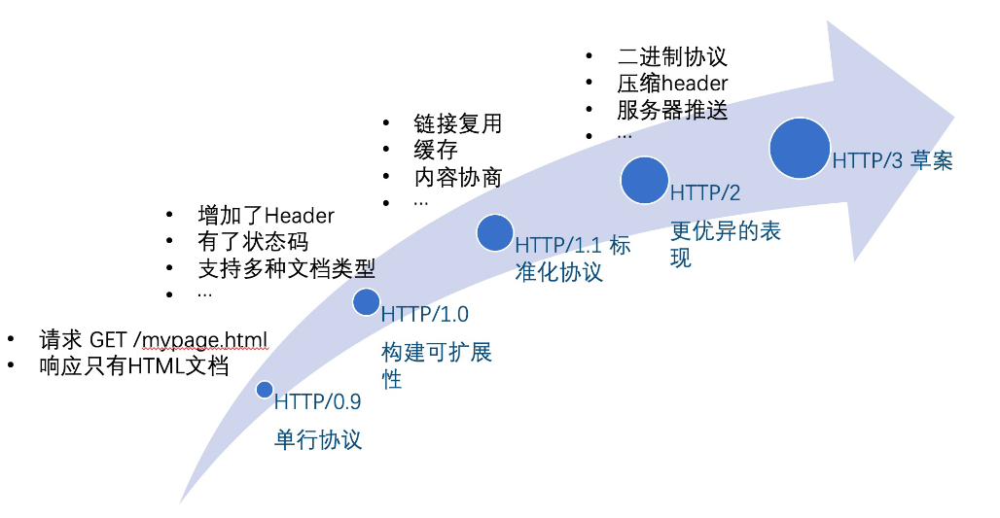

<!-- START doctoc -->

<!-- END doctoc -->

# 👏js相关

## 👀基础

### 1.js单线程,为什么？

js单线程，原因避免dom渲染冲突

### 2.js数据类型？

1. 分为两类：
   
   - 7种简单数据类型：Number、String、 Boolean、 null 、undefined 、BigInt 、Symbol
   
   - 1种复杂数据类型：Object

2. 本质区别：存储方式不同
   
   - 简单数据类型存储在栈中
   
   - 引用数据类型存储在堆中，栈中存放的是它在堆中的指针。

3. es6新数据类型：
   
   - Symbol的特点是它的值是唯一的，可以作为对象的属性标识符。如`obj[Symbol('a')] = 'a'`。Symbol属性不能使用for in 和`Object.getOwnPropertyNames()`得到。需要使用`Object.getOwnPropertySumbols`。
   
   - BigInt是一个内置对象，可以用来表示任意大的整数。定义时可以直接在一个整数后面加上'n'，或者调用`BigInt('12348329483029432')`传入一个整数值或字符串值来创建。字符串值必须是一个数字的字符串，含有字母会报错。不能和Number类型一起运算，否则会报错。

### 3.创建对象的几种方式？

```javascript
var o1 = {name:'abcd01'};
var o2 = new Object({name:'abcdo2'});
function M(name) {
    this.name=name;
}
var o3 = new M('abcdo3');
var p={name:'abcdp'};
var o4 = Object.create(p);
// ps:o4创建了一个原型，o4.__proto__===p
```

### 4.new操作符具体干了什么呢?

（1）创建一个空对象，并且 this 变量引用该对象，同时还继承了该函数的原型。

（2）属性和方法被加入到 this 引用的对象中。

（3）新创建的对象由 this 所引用，并且最后隐式的返回 this 。

### 5.DOM事件类

捕获、冒泡和自定义事件。

当一个事件触发时是先从上到下触发对应的事件监听器，再冒泡去触发对应的事件监听器。

- 捕获（上到下）顺序 `window=>document=>html(document.documentElement获得html标签)>body>...`

```javascript
dom.addEventListener('click',function () { //dom为上一行捕获的对象
    console.log(123);//上一行每一个对象所捕获
},true); //为true才可以捕获
```

- 冒泡（下到上）和上面相反
  
  - Event对象常见应用：

```javascript
event.preventDefault();

event.stopPropagation();

event.stopImmediatePropagation() ; //一个对象有多个事件，添加这句话，其他的不会在执行

event.currentTarget； //当前所绑定的事件，父级对象

event.target
```

- 自定义事件

```javascript
//var eve = new Event('custome');

    //var eve = new Event('custome');
    var eve = new CustomEvent('custome', {
        detail: {
            username: "davidwalsh"
        }
        });//可以增加参数
    dom.addEventListener('custome',function (e) {
        console.log(e.detail)
    });
        dom.dispatchEvent(eve);//触发自定义事件
```

### 6. for in 与 for of 的区别

**for in**

- 首先，for in 就是用来遍历对象属性用的，遍历数组等最好不要使用，它的效率比较低

- for in 遍历对象属性是会进行原型链搜索，因此继承的属性也会被遍历到，如果不想遍历继承的属性和方法可以使用 `hasOwnProperty()`方法判断该属性是否该对象的实例属性。

- for in 执行过程
  
  - 判断in后的表达式结果
    
    - undefined或null则报错或跳过
    - 数字、字符串或布尔值转换为包装对象
  
  - 运行in前面的表达式，从后面的对象取属性赋值给该结果（左值）
  
  - 执行循环体
  
  - 重复前面2个步骤
    
    ```js
    // 利用这个特性，可以将对象属性拷贝到数组
    let obj = {
      name: 'zs',
      age: 20
    }
    let a = []
    let i = 0
    for (a[i++] in obj);
    console.log(a)
    // [ 'name', 'age' ]
    ```

- for in 遍历数组得到的是数组各项的索引，是字符串类型的

**for of**

- 这是ES6新增的，它遍历数组内的元素，不包括原型和索引
- 可以遍历数/数组对象/字符串/map/set等拥有迭代器对象（iterator）的集合，但是**不能遍历对象，因为对象不含迭代器对象。**

**总结**

| 类型  | for in    | for of          |
|:---:|:---------:|:---------------:|
| 数组  | 索引（字符串类型） | 值               |
| 字符串 | 索引（字符串类型） | 值               |
| 对象  | 属性（字符串类型） | 报错              |
| 数字  | 不报错但拿不到值  | 报错              |
| Set | 不报错但拿不到值  | 值               |
| Map | 不报错但拿不到值  | 各项['key','val'] |

- for of 不能遍历对象和数字，其他都能拿到值，其中Map拿到的是数组

- for in 都可以遍历，但只有数组、字符串和对象能拿到属性（索引）

### 7. 说一说promise是什么与使用方法？

1. **Promise的作用**：Promise是异步微任务，解决了异步多层嵌套回调的问题，让代码的可读性更高，更容易维护。

2. **Promise创建**：Promise是ES6提供的一个构造函数，可以使用Promise构造函数new一个实例，Promise构造函数接收一个函数作为参数，这个函数有两个参数，分别是两个函数 `resolve`和`reject`，`resolve`将Promise的状态由`pending`变为`resolved`（也叫`Fulfilled`），将异步操作的结果作为参数传递过去；`reject`则将状态由`pending`转变为`rejected`，在异步操作失败时调用，将异步操作报出的错误作为参数传递过去。

3. **链式调用**：实例创建完成后，可以使用`then`方法分别指定成功或失败的回调函数，也可以使用catch捕获失败，then和catch最终返回的也是一个Promise，所以可以链式调用。

4. **Promise特点**：
   
   1. 状态只能由pending变为fulfilled或从pending变为rejected，状态一旦发生变化就不可逆。
   
   2. then方法和catch只要不报错，返回的都是一个fulfilled的Promise
   
   3. Promise各种方法（今晚看一下红宝书）

### 8. 函数的name属性可以修改吗？

函数的name属性返回函数实例的名称。

使用`new Function(...)`语法创建的函数的name属性为`"anonymous"`

`Function.bind()`所创建的函数将会在函数的名称前加上"bound " 。

```js
function foo() {};
foo.bind({}).name; // "bound foo"
```

### 9. 结果？

```js
var foo = function () {
    console.log(2)
}
function foo() {
    console.log(1)
}

foo()
```

无论两个声明的的顺序如何，结果都是2，`var`赋值是在运行阶段，`function`声明是在解析阶段，运行阶段foo会被赋值为打印2的函数

```js
function foo() {
    console.log(1)
}
var foo = 2
foo()
```

这一段会报错，foo不是函数。

### 10. 变量提升

1. js会把变量声明部分和函数声明部分提升到函数作用域或全局作用域顶端，变量会有一个初始值undefined。

2. **编译阶段**，同名的函数会选择最后声明的那个，如果变量和函数同名，变量声明会被忽略，但是执行阶段，变量赋值照常进行。

### 11. js作用域

1. 全局作用域

2. 函数作用域

3. 块级作用域：在一个上下文中，let / const 声明的变量会被放在词法环境中，其内部维护了一个最小栈结构，进入一个作用域块就将该作用域块的变量压入栈顶，执行完后就弹出。而其他的var声明的变量则存放在变量环境中。查找变量时会沿词法环境栈顶向下查找，如果找到就返回，找不到就到变量环境中找。

### 12. 词法环境

词法环境

- 环境记录
  
  - 声明式环境记录
    
    - 函数环境记录
    
    - 模块环境记录（let const）
  
  - 对象式环境记录（var）

- 对外部词法环境的引用

### 13. Symbol

1. What?es6新增的原始数据类型，具有唯一性和不可变性。

2. Why?主要作用是作为属性的唯一标识符，防止对象属性发生冲突。

3. How?
- 使用`Symbol()`创建，可以传入字符串，但是每一个symbol都和传入的字符串无关，都是唯一的，用相同字符串创建的Symbol也是不一样的。

- 不能和new一起使用，是为了避免创造出包装对象。

- 重用Symbol的唯一方式是使用`Symbol.for(字符串)`来在全局注册表中注册，访问时也是用`Symbol.for(字符串)`，系统会检查全局注册表中是否注册过该`Symbol`，如果注册过就使用，没有就注册一个。传入参数都会被转换为字符串。

- `Symbol.keyFor(全局注册的Symbol)`用于查询一个全局注册Symbol对应的字符串，找不到返回undefined

- 用作对象字面量属性时加上一个`[]`。

- es6内置了一批符号，比如`Symbol.iterator`，在规范里经常带上前缀`@@iterator`

### 14. 判断数据类型

1. typeof: 返回对应的字符串，但是null返回的是`'object'`，且无法区分`Object`类型具体是哪一种。

2. `instanceof`: 原理是判断右边构造函数的`prototype`是否在左边值的原型链上。

3. `Object.prototype.toString.call()`，可以准确判断数据类型，返回值形式为`[object xxx]`

### 15. 如何避免js阻止DOM渲染

感觉这题可以是为了考察浏览器的渲染过程，所以渲染过程也可以说一说。

1. 尽量把嵌入的js脚本放到body的最下面，这样会等DOM渲染完才执行js

2. 可以给外链的`script`加上`sync`或`defer`来异步加载脚本，这样在脚本加载过程中不会阻塞DOM渲染，不过当脚本加载完后还是会执行且阻塞DOM渲染只是节省了请求的实践。但是两者有区别，sync一旦加载完脚本立即执行，defer执行时机不定，会在`DOMContentLoaded`事件之前执行。

3. 为了节约请求时间，对于一些比较小的js可以采用内联的方式来嵌入html文件。

4. 有一些大的js就不适合内联，那么可以采用压缩的方式减小体积降低请求时间。

### 16. js数组怎么去重?

1. reduce

2. Set

3. for

### 17. 字面量new出来的对象和 Object.create(null)创建出来的对象有什么区别?

字面量和new创建出来的对象都会继承Object的属性和方法，它们的隐式原型指向Object的显式原型。

而 `Object.create(null)`创建出来的对象原型为null,作为原型链的最顶端，没有继承Object的方法和属性。

## 👀核心

### 1.闭包及其应用 ？

**JavaScript之所以存在闭包是因为我们在词法作用域的环境下写代码，而其中的函数也是值，可以随意传来传去。我们在词法作用域的环境下写代码，而其中的函数也是值，可以随意传来传去。**

[【JavaScript修炼】闭包和虽死犹存的函数](https://blog.csdn.net/laplacepoisson/article/details/124662698)

1. 闭包就是函数及其对周围环境的引用。通常在实践中，我们所认为的闭包是这样的：如果一个函数引用了它的外部变量，且外部变量所在的这个执行上下文已经被销毁了，但是这个函数被调用时依然能访问到那些变量，这就是闭包。

2. 从内存模型的角度来理解的话就是：遇到函数调用，首先创建一个空的执行上下文，然后进行代码执行前的准备工作，包括使用函数的arguments初始化变量对象，将变量声明函数声明等添加到变量对象，确定作用域链，确定this指向等。然后还会对函数内部的函数进行**预扫描（词法扫描）**，如果发现其有对外部函数变量的引用就会在堆中创建一个closure的内部对象，用来保存这些变量，这个也就是我们所说的闭包。

利用闭包可以写一个模块管理器：

```js
var MyModules = (function Manager() {
  var modules = {}

  function define(name, deps, impl) {
    for (var i = 0; i < deps.length ; i++) {
      deps[i] = modules[deps[i]]
    }
    modules[name] = impl.apply(impl , deps)
  }

  function get(name) {
    return modules[name]
  }

  return {
    define:define,
    get: get
  }
})()

// 定义模块
MyModules.define('bar', [], function () {
  function hello(who) {
    return 'hello ' + who
  }
  return {
    hello
  }
})

var bar = MyModules.get('bar')

```

### 2.谈谈javascript作用域链？

 [【JavaScript修炼】变量对象与作用域链_前端corner的博客-CSDN博客](https://blog.csdn.net/laplacepoisson/article/details/124658971)

当执行一段JavaScript代码（全局代码或函数）时，JavaScript引擎会创建为其创建一个执行上下文（Execution Context），在页面加载后会首先创建一个全局的执行上下文，每遇到函数调用就会创建一个执行上下文并压入执行上下文栈中。作用域链的作用是用于解析标识符，当执行上下文被创建后，js引擎进入执行上下文，用arguments、命名参数和该函数中的所有局部变量创建一个变量对象，然后激活对象，将变量对象添加到当前的执行上下文中。然后利用函数内部的[[Scopes]]属性初始化作用域链，将当前执行上下文的激活对象添加到作用域链的最前端。

函数的[[Scopes]]属性是在函数定义时就确定的，因为javascript的作用域是词法作用域。

### 3.如何理解JavaScript原型链？

JavaScript中的每个对象都有一个prototype属性，我们称之为原型，而原型的值也是一个对象，因此它也有自己的原型，这样就串联起来了一条原型链，原型链的链头是Object,它的prototype比较特殊，值为null。

原型链的作用是用于对象继承，函数A的原型属性(prototype property)是一个对象，当这个函数被用作构造函数来创建实例时，该函数的原型属性将被作为原型赋值给所有对象实例，比如我们新建一个数组，数组的方法便从数组的原型上继承而来。

当访问对象的一个属性时, 首先查找对象本身, 找到则返回; 若未找到, 则继续查找其原型对象的属性(如果还找不到实际上还会沿着原型链向上查找, 直至到根). 只要没有被覆盖的话, 对象原型的属性就能在所有的实例中找到，若整个原型链未找到则返回undefined。

### 4. 如何确定this的指向？

一般this就是调用函数的对象。

要确定this的指向，首先得知道什么是MemberExpression.

- - PrimaryExpression // 原始表达式 可以参见《JavaScript权威指南第四章
  
  - FunctionExpression // 函数定义表达式
  
  - MemberExpression [ Expression ] // 属性访问表达式
  
  - MemberExpression . IdentifierName // 属性访问表达式
  
  - new MemberExpression Arguments // 对象创建表达式

- 确定this的关键是先计算 MemberExpression 得到ref，然后判断ref是否为一个Reference。

- **属性访问表达式**返回Reference,例如`foo.bar`

- 括号并不会调用括号内的reference的GetVlue，如`(foo.bar)`

- **赋值（“=”）操作符**、**二元逻辑运算符（“||”）**、**逗号操作符**计算算得到的ref是调用GetValue得到的值，所以结果不是Reference，如`(foo.bar = foo.bar)`

- getBase得到的值只可能是 undefined, an Object, a Boolean, a String, a Number, 和 an environment record 中的一种。

**只有当ref既是Reference又是一个对象的时候，this的值是调用getBase得到的结果，否则this都为undefined,只不过在非严格模式下，undefined会被隐式转换为全局对象。最常见的计算结果为Reference的MemberExpression就是属性访问表达式了。这也就是为什么我们常说this就是调用函数的对象。****

### 5. 说一说IIFE

- IIFE就是立即调用的函数表达式。

- 可以像下面这样调用它
  
  - `(function(){})()`
  
  - `(function(){}())`

- 或者是像下面这样，将圆括号左侧变为一个表达式，也可以调用它：
  
  - `var i = function(){}()`
  
  - `!function(){}()`
  
  - `true && function(){}()`

- 立即执行函数的应用：
  
  - 可以保存闭包状态
  
  - 使用模块化的写法避免全局变量的污染

### 6.promise只能进行异步操作吗？

这个问题的本质其实就是有一个函数，它接收了一个回调函数，能不能根据函数的执行清况来决定什么时候调用回调函数呢？

先想一想如果可以的话会怎么样？优点的话当然是很灵活，我根据具体的情况来选择回调的执行时刻。缺点其实也很明显，就是我不能明确回调的调用时刻了，因为有些时候函数的执行情况我们是不好去判定的。

这里的话可以考虑一个清况，比如我们new了一个promise，在这个promise里面我们直接确定resolve了一个值，并没有进行异步操作，那么这个时候调用then方法会不会立即执行呢？答案是不会的。

第一点就是在PromiseA+规范里明确指出Promise只能用异步调用的方式。

第二点就是为什么？如果根据函数执行情况来决定何时调用回调，那么就有一个问题，我称之为依赖链，就是`调用回调 -> 函数执行情况 -> 函数位置？函数调用者？函数参数？`，于是代码就混乱了，但是如果说我们统一都是用异步的方式来执行回调就不会有这样的问题，我们不用去关系函数是什么执行的。

这就是我理解的Promise统一为异步调用的意义。

顺便提及一下，我们在写传统回调的时候，如果想要和promise一样统一为异步调用，我们可以用setTimeout0将回调做一层包裹，这样回调就坑定是异步调用的了。

### 7. this设计缺陷和应对方案

```js
var myObj = {
  name : "john", 
  showThis: function(){
    console.log(this)
    function bar(){console.log(this)}
    bar()
  }
}
myObj.showThis()

你会发现函数 bar 中的 this 指向的是全局 window 对象，
而函数 showThis 中的 this 指向的是 myObj 对象。
这就是 JavaScript 中非常容易让人迷惑的地方之一，也是很多问题的源头。
```

1. 嵌套函数中的this不会从外层函数中继承。解决方式是在外层函数中声明一个变量来保存this，然后在内层函数使用该变量。

2. 第二种方式就是内层函数使用ES6的箭头函数，因为它不会创建自己的执行上下文，它的this取决于外部函数。

3. 普通函数的this默认指向全局window对象，但是严格模式下，函数的执行上下文中的this默认为undefined


### 8. 手写call、apply、bind？

**call**

```js
Function.prototype.my_call = function (context) {
  // 调用者不是函数，抛出错误
  if (typeof this !== 'function') {
    throw new Error('Not a function')
  }
  // context不传参时默认为window
  context = context || window
  // 为context设置fn方法
  context.fn = this
  // 将arguments伪数组转为真正的数组并截取第一个context参数后的参数
  let args = Array.from(arguments).slice(1)
  // 调用fn并传入参数
  let result = context.fn(...args)
  // 删除context上的fn方法
  delete context.fn
  // 返回执行结果
  return result
}
```

**apply**

```js
Function.prototype.my_apply = function (context) {
  // 调用者不是函数，抛出错误
  if (typeof this !== 'function') {
    throw new Error('Not a function')
  }

  let result

  // context不传参时默认为window
  context = context || window

  // 为context设置fn方法
  context.fn = this

  if (arguments[1]) {
    result = context.fn(...arguments[1])
  } else {
    result = context.fn()
  }

  delete context.fn

  return result
}

```

**bind**

```js
Function.prototype.myBind = function (context) {
  // 判断是否是一个函数
  if (typeof this !== 'function') {
    throw new TypeError('Not a Function')
  }
  // 保存调用bind的函数
  const _this = this
  // 保存参数
  const args = Array.prototype.slice.call(arguments, 1)
  // 返回一个函数
  return function F() {
    // 判断是不是new出来的
    if (this instanceof F) {
      // 如果是new出来的
      // 返回一个空对象，且使创建出来的实例的__proto__指向_this的prototype，且完成函数柯里化
      return new _this(...args, ...arguments)
    } else {
      // 如果不是new出来的改变this指向，且完成函数柯里化
      return _this.apply(context, args.concat(...arguments))
    }
  }
}

```


### 9. javascript继承方式及其优缺点

[【JavaScript修炼】javascript多种继承方式及其优缺点_前端corner的博客-CSDN博客](https://blog.csdn.net/laplacepoisson/article/details/124624832)


## 👀ES6

### 1.class

es6的class其实就是个语法糖，babel转出来的依旧是寄生组合式继承。 具体的使用没有太多的可以说的，需要注意super即可以当函数，也可以实例。这部分不做细说，因为很复杂，有兴趣参考[es6 Class的继承](http://es6.ruanyifeng.com/#docs/class-extends#super-%E5%85%B3%E9%94%AE%E5%AD%97)。  
需要注意的是，**ES5的继承，实质是先创造子类的实例对象this，然后再将父类的方法添加到this上面（Parent.apply(this)）。ES6 的继承机制完全不同，实质是先创造父类的实例对象this（所以必须先调用super方法），然后再用子类的构造函数修改this。**

### 2. let const var 的区别？

1. var声明的变量是**函数作用域**的，会发生变量提升现象。在编译的过程中，会把var声明的变量提升到函数作用域顶部，变量的值为undefined。然后在代码声明的地方才被赋值。这个特性允许我们在变量声明之前使用变量。

2. let和const都是**块作用域**的，不会有变量提升现象。所以必须在声明之后才能使用。如果在声明之前使用会报错。

3. let 和 const声明的变量是与其所在**作用域绑定**的，会存在**暂时性死区**，即作用域内，变量声明之前的区域。在暂时性死区中访问该变量会报错。

4. var 和 let 声明变量时都可以不赋值，此时变量的值为undefined。但是const必须在声明时就**初始化**，不允许先声明后赋值。

5. let 和 const 都不允许**重复声明**而var可以。

6. const 用于声明**只读常量**，所谓常量是指并不是指它的值不变，而是指它所指向的内存地址保存的数据不变。对于Number、String、布尔值该地址所保存的就是值本身，所以不能修改。而对于对象该地址只是保存了对象的指针，所以可以修改。

7. let 和 const 声明的变量不属于**顶层对象**，var声明的变量是顶层对象的属性。在浏览器顶层对象为window，node中则为global。

扩展：**怎么冻结对象？**

可以封装一个递归函数，使用`Object.freeze()`来冻结。

```js
var constantize = (obj) => {
  Object.freeze(obj);
  Object.keys(obj).forEach( (key, i) => {
    if ( typeof obj[key] === 'object' ) {
      constantize( obj[key] );
    }
  });
};
```

## 👀DOM

### 1.直接绑定和事件监听有哪些区别？

- 直接绑定对于一个事件只能有**一个处理函数**，再次绑定会覆盖处理函数。事件监听对于同一事件可以有**多个处理函数。**
- 只有**html元素、document对象，window对象**可以使用直接绑定；监听器除那三个还可以是**任何其他支持事件的对象**，如[XMLHttpRequest](https://developer.mozilla.org/zh-CN/docs/Web/API/XMLHttpRequest).
- 事件监听可以通过第三个参数（配置对象Options或布尔值useCapture,默认为false）**指定事件监听器的触发阶段（冒泡或捕获）。**

补充：

- click 事件的运行顺序在 [mousedown](https://developer.mozilla.org/zh-CN/docs/Web/API/Element/mousedown_event) 和 [mouseup](https://developer.mozilla.org/zh-CN/docs/Web/API/Element/mouseup_event) 事件之后。
- [mdn关于兼容性的封装](https://developer.mozilla.org/zh-CN/docs/Web/API/EventTarget/addEventListener#%E5%85%BC%E5%AE%B9%E6%80%A7)

### 2.节流(throttle)防抖 (debounce)

- debounce: 事件触发时，相应函数延迟一会才执行。当密集触发时函数执行会被一直延迟。应用：输入框发送请求。
- throttle: 事件触发时，节流函数会按照一定频率执行事件处理函数。

[手撕源码系列 —— lodash 的 debounce 与 throttle](https://zhuanlan.zhihu.com/p/91110334)

### 3. 事件委托

事件委托利用了冒泡的特点，举个例子，如果想要在大量子元素中单击任何一个都可以运行一段代码，您可以**将事件监听器设置在其父节点**上，**并让子节点上发生的事件冒泡到父节点上，而不是每个子节点单独设置事件监听器。**

先捕获后冒泡。

****

# 👏框架

## 👀Vue

### 1. vue组件通信方式？

[官方文档事件总线](https://v3.cn.vuejs.org/guide/migration/events-api.html#%E4%BA%8B%E4%BB%B6%E6%80%BB%E7%BA%BF)

**总述：一共有7、8种方式**

- props
- \$emit / \$on
- \$children / \$parent
- \$attrs / $listeners
- ref
- $root
- eventbus
- vuex

其中在vue3中\$on/\$parent/$listeners这些api已经被废除

事件api的废除使得eventbus实现起来不是很方便，可以通过引入第三方实现了事件触发器接口的库，例如 [mitt](https://github.com/developit/mitt) 或 [tiny-emitter](https://github.com/scottcorgan/tiny-emitter)。

\$children的替代可以使用$refs。

\$listeners废弃后直接通过$attrs就可以访问添加在组件上的事件监听器。

**根据组件关系阐述**

- **父子组件**

- props / emit / $parent / ref / $attrs(爷孙之间透穿属性)

- **兄弟组件**

- $parent / $root / eventbus / vuex

- **跨层级组件**

- vuex / eventbus / provide / inject

### 2. v-if 和 v-for 哪个优先级高？

思路

- 结论
- 为什么，细节
- 场景
- 总结拔高

这个问题在官方文档中其实有[详细描述](https://cn.vuejs.org/v2/style-guide/#%E9%81%BF%E5%85%8D-v-if-%E5%92%8C-v-for-%E7%94%A8%E5%9C%A8%E4%B8%80%E8%B5%B7%E5%BF%85%E8%A6%81)。

1. 在vue2中，v-for的优先级高于v-if。而vue3中，v-if的优先级高于v-for。
2. 一般有两种情况可能会这样做
- 为了过滤一个列表中的项目，`v-for="user in users" v-if="user.isActive"`，推荐直接使用计算属性做列表过滤。
- 为了避免渲染本应该被隐藏的列表，`v-for="user in users" v-if="shouldShowUsers"`，这种情况应该把`v-if`放到父容器上。
3. 平时在实践中一定要避免v-for和v-if同时出现在一个元素上。
4. 在vue2中，两者放在一起输出的渲染函数是先执行循环，在循环里判段；vue3中是先判断再决定是否循环。

```javascript
// vue3
return function render(_ctx, _cache) {
  with (_ctx) {
    const { createCommentVNode: _createCommentVNode, renderList: _renderList, Fragment: _Fragment, openBlock: _openBlock, createElementBlock: _createElementBlock, toDisplayString: _toDisplayString, createElementVNode: _createElementVNode } = _Vue
    return (_openBlock(), _createElementBlock(_Fragment, null, [
      _createCommentVNode(" 过滤列表中项目 "),
      _createCommentVNode(" 过滤列表中项目 "),
      _createCommentVNode(" 浏览器控制台会报错：Uncaught TypeError: Cannot read properties of undefined (reading 'isActive') "),
      _createCommentVNode(" <div id=\"app\">\n      <div v-for=\"item in items\" :key=\"item.id\" v-if=\"item.isActive\">\n        {{ item.name }}\n      </div>\n    </div> "),
      _createCommentVNode(" 避免渲染应该被隐藏的列表 "),
      _createElementVNode("div", _hoisted_1, [
        shouldShowUsers
          ? (_openBlock(true), _createElementBlock(_Fragment, { key: 0 }, _renderList(items, (item) => {
              return (_openBlock(), _createElementBlock("div", { key: item.id }, _toDisplayString(item.name), 1 /* TEXT */))
            }), 128 /* KEYED_FRAGMENT */))
          : _createCommentVNode("v-if", true)
      ])
    ], 2112 /* STABLE_FRAGMENT, DEV_ROOT_FRAGMENT */))
  }
}
// vue2
(function anonymous(
) {
with(this){return _c('div',{attrs:{"id":"app"}},[_c('div',{attrs:{"id":"app"}},_l((items),function(item){return (shouldShowUsers)?_c('div',{key:item.id},[_v("\n        "+_s(item.name)+"\n      ")]):_e()}),0)])}
})
```

### 3.[面试官：说说你对vue的理解? ](https://github.com/febobo/web-interview/issues/1)

- vue是什么？
  
  - Vue.js（/vjuː/，或简称为Vue）是一个用于创建用户界面的开源JavaScript框架，也是一个创建**单页应用**的Web应用框架。
  
  - Vue所关注的核心是MVC模式中的**视图层**，同时，它也能方便地**获取数据更新**，并通过组件内部特定的方法实现视图与模型的交互

- vue的核心特性：
  
  - 数据驱动MVVM：三层
  
  - 指令系统
    
    - 带有 v- 前缀的特殊属性作用：当表达式的值改变时，将其产生的连带影响，响应式地作用于 DOM
    
    - 常用的指令
  
  - 组件化
    
    - 把图形、非图形的各种逻辑均抽象为一个统一的概念（组件）来实现开发的模式
    
    - 降低整个系统的耦合度
    
    - 调试方便
    
    - 提高可维护性

- vue与传统开发区别：
  
  - vue通过操作数据来操作界面事件，不操作DOM
  
  - DOM的变化是数据变化导致的，即DOM与数据绑定。

### 4.[面试官：Vue3.0的设计目标是什么？做了哪些优化?](https://github.com/febobo/web-interview/issues/45)

更小、更快、更友好、优化方案。

- 更小
  
  - `Vue3`移除一些不常用的 `API`
  
  - 引入`tree-shaking`，可以将无用模块“剪辑”，仅打包需要的，使打包的整体体积变小了

- 更快：主要体现在编译方面：
  
  - diff算法优化
  - 静态提升
  - 事件监听缓存
  - SSR优化

- 更友好：composition API
  
  - 很多类似的第三方库，我们只需要调用即可，不必关注实现过程，开发效率大大提高.
  
  - `VUE3`是基于`typescipt`编写的，可以享受到自动的类型定义提示

- 优化方案
  
  - `vue3`从很多层面都做了优化，可以分成三个方面：
    
    - 源码
    - 性能
    - 语法 API
  
  - 源码
    
    - 将不同的模块拆分到`packages` 目录下面不同的子目录中，使得模块拆分更细化，职责划分更明确，模块之间的依赖关系也更加明确，开发人员也更容易阅读、理解和更改所有模块源码，提高代码的可维护性
    
    - 一些 `package`（比如 `reactivity` 响应式库）是可以独立于 `Vue` 使用的
  
  - 性能
    
    - 体积优化
    
    - 编译优化
    
    - 数据劫持优化

### 5. Vue特点

1. 两个核心功能
* 声明式渲染：通过模板语法声明式地描述基于js状态的HTML解构

* 响应式：Vue会自动追踪数据变化，响应式地更新DOM视图。
2. 渐进式的Web开发框架
* 灵活性和可逐步集成，可以以多种方式使用。

* 作为独立脚本

* 嵌入web component，特点就是适应性非常强，因为web component是原生标准，所以可以嵌入到任何页面甚至其他框架。

* 有一套构建SPA的生态系统，包括路由如vue-router,构建工具vue-cli，开发者调试工具，还支持typescript集成
3. 使用单文件组件（SFC），里面可以书写js，css和html

4. vue3还推出了composition api，之所以叫做组合式api一个原因是因为它可以很方便地抽离重复逻辑到单独文件中，并且在这个文件中又可以引入其他的单文件工具，可以组合起来。像Vueuse就封装了100多个使用的逻辑。

# 👏浏览器

## 1.你知道哪些跨页面通信的方式呢？

[面试官：前端跨页面通信，你知道哪些方法？ - 掘金](https://juejin.cn/post/6844903811232825357)

- 广播模式：Broadcast Channe / Service Worker / LocalStorage + StorageEvent
- 共享存储模式：Shared Worker / IndexedDB / cookie
- 口口相传模式：window.open + window.opener
- 基于服务端：Websocket / Comet / SSE 等

**同源页面**

- **Broadcast Channel**
  
  - 它允许同源的不同浏览器窗口，Tab页，frame或者 iframe 下的不同文档之间相互通信。
  
  ```javascript
  var bc = new BroadcastChannel('internal_notification');
  bc.postMessage('New listening connected!');
  ```

- **Service Worker**

    在 Service Worker 中监听了`message`事件，获取页面（从 Service Worker 的角度叫 client）发送的信息。然后通过`self.clients.matchAll()`获取当前注册了该 Service Worker 的所有页面，通过调用每个client（即页面）的`postMessage`方法，向页面发送消息。这样就把从一处（某个Tab页面）收到的消息通知给了其他页面。

- **LocalStorage**

当前页面使用的storage被其他页面修改时会触发StorageEvent事件，该事件对象上有5个只读的属性：`key newValue oldValue storageArea url`

- **Shared Worker**

- **IndexedDB**

- **window.open + window.opener**

**非同源页面**

- **iframe**

使用一个用户不可见的 **iframe **作为“桥”。由于 iframe 与父页面间可以通过指定`origin`来忽略同源限制，因此可以在每个页面中嵌入一个 iframe （例如：`http://sample.com/bridge.html`），而这些 iframe 由于使用的是一个 url，因此属于同源页面，其通信方式可以复用上面第一部分提到的各种方式。

### 2. 浏览器加载白屏是什么原因？

- 请求发出前可能有：
  
  - 资源不合法，如跨域，https 用 http 等等，csp 等等
  
  - 请求队列太多或者本资源优先级不够高，资源被 delay
  
  - dns 出问题，劫持，自己开了代理，dns 服务器挂了等等

- 请求发送过程中可能有：
  
  - 没有到达服务器，如 cdn 挂了
  
  - 到达服务器但是没有到达处理程序，如在队列里堆积，403，401 等等
  
  - 到达了处理程序，但 500 了（假设 500 也算白屏的话，因为可能有只是 catch 了错误，啥也没干）
  
  - 成功运行，但是迟迟没有返回，如代码本身耗时久，死循环，rpc 慢等等

- 请求返回之后可能有：
  
  - 解析阶段跪了，如要 json 返回了一段 text，json/js 不合规范等等
  
  - 执行阶段跪了，如 render 挂了（假设没有针对这一情况做处理，那么就白屏了），死循环，也有可能是纯粹代码写错了，比如 data 写成了 date，css 写错比如设置了 display：none 等等

- 其它：
  
  - 突然断网了
  
  - 客户端的锅

- Roast:

这个题分阶段阐述更为清晰，笼统的讲述容易有所遗漏。 思考时，需要考虑到用户环境、前端部署、后端服务三个方面的内容。

### 3. 如何理解重排和重绘？

1. 重排和重绘是浏览器关键渲染路径上的两个节点， 浏览器的关键渲染路径就是 DOM 和 CSSOM 生成渲染树，然后根据渲染树通过一个布局(也叫 layout)步骤来确定页面上所有内容的大小和位置，确定布局后，将像素 绘制 (也叫 Paint)到屏幕上。

2. 其中重排就是当元素的**位置发生变动**的时候，浏览器重新执行布局这个步骤，来重新确定页面上内容的大小和位置，确定完之后就会进行重新绘制到屏幕上，所以**重排一定会导致重绘。**

3. 如果元素位置没有发生变动，仅仅只是**样式发生变动**，这个时候浏览器重新渲染的时候会**跳过布局步骤，直接进入绘制步骤**，这就是重绘，所以**重绘不一定会导致重排。**

**这道题一般考察两个点：**

1. **浏览器的关键渲染路径**。如果答不到这上面，一般这个题就凉了。
2. 性能优化，如果减少重绘和回流，当然这个点肯定也是要基于对 **关键渲染路径** 的理解（这点不是关键点）。

参考文章： [【面试系列一】如何回答如何理解重排和重绘](https://segmentfault.com/a/1190000041554442)

### 4. V8执行代码过程

1. tokenize,分词也叫词法分析，生成token

2. parse，解析，也叫语法分析，根据语法规则将token转换为AST

3. 有了AST，V8会创建执行上下文

4. 生成字节码，解释器根据AST生成字节码

5. 代码执行，解释器逐条解释执行字节码，如果发现热点代码(HotSpot),编译器会将该代码编译为高效的机器码，之后再执行相同代码就直接执行机器码。

6. 由于js的动态特性，对象的属性和结构可能发生改变，那么之前优化生成的机器码就无用了，需要执行反优化操作回退到解释器解释执行。

### 5. 垃圾回收机制

**堆分区、新生代、老生代、一区一器、先标记，再回收，后整理，全停顿，并发式回收，并行式回收，增量式回收。**

1. 垃圾回收主要针对堆中的内存进行回收。

2. 堆分为新生代和老生代两个区域，新生代空间小（1-8M），存放生命周期短的对象。老生代空间大，存放生命周期长的对象和大对象。

3. 副垃圾回收器负责新生代的垃圾回收，主垃圾回收器负责老生代的来及回收。

4. 回收的执行流程都遵循以下过程：
   
   1. 标记活动对象和非活动对象，活动对象就是还在使用的对象，非活动对象就是可以回收掉的对象。
   
   2. 回收非活动对象占据的内存。
   
   3. 整理回收之后产生的内存碎片。内存碎片可能会造成没有足够的连续空间来存放大对象。

5. 副垃圾回收器采用Scavenge算法，将新生代空间对半分为两个区域，一半对象区域一半空闲区域。新加入的对象放入对象区域，如果对象区域要满了就要执行一次垃圾回收。回收时是将对象区域的对象复制到空闲区域中并有序排列起来解决内存碎片问题，然后对象区域和空闲区域角色互换，完成垃圾回收。

6. js引擎还采用了对象晋升策略，如果经过两次垃圾回收仍然存活的对象会被移到老生区。

7. 主垃圾回收器采用标记清除算法，标记完后原地清除，但是这样会导致内存碎片问题，所以还有另一种算法：标记整理算法，就是将存货对象移动到老生代的一段，然后将另一端的非活动对象回收。

8. 全停顿现象是指由于js单线程的原因，当执行垃圾回收时，js线程暂停执行的现象。因此采用了增量标记算法，将一次完整的回收过程分成多个小的过程。同时还有其他一些方式如采用多个辅助垃圾回收线程。

### 6. 如何写一个会过期的localStorage，说说想法

有两种方案：**惰性删除**和**定时删除**

**惰性删除**

* 惰性删除是指某个键值过期以后不会被立刻删除，而是在下次被使用的时候才会检查是否过期，如果过期就删除。

* 惰性删除实现了可过期的localStorage缓存，但是也有比较明显的缺点：如果一个key一直未被使用，那么这个key即使过期了也会一直存在。为了弥补这样缺点，可以使用另一种清理过期缓存的策略，即**定时删除**。

**定时删除**

* 定时删除是指，每隔一段时间执行一次删除操作，并通过限制删除操作执行的次数和频率，来减少删除操作对CPU的长期占用。另一方面定时删除也有效的减少了因惰性删除带来的对localStorage空间的浪费。
* 具体实现时可以采取以下策略
  * 首先通过Object.keys(localStorage)来获取所有的key,然后遍历key用正则表达式匹配出可过期的key
  * 每隔一秒执行一次定时删除，操作如下：
    1. 随机测试20个设置了过期时间的key。
    2. 删除所有发现的已过期的key。
    3. 若删除的key超过5个则重复**步骤1**，直至重复500次。

**代码**

* 惰性删除
  
  ```js
  var lsc = (function (self) {
  var prefix = 'one_more_lsc_'
  
  // 写入
  self.set = function (key, val, expires) {
    key = prefix + key
    val = JSON.stringify({
      val: val,
      expires: Date.now() + expires * 1000
    })
    localStorage.setItem(key, val)
  }
  
  // 读取
  self.get = function (key) {
    key = prefix + key
    let val = localStorage.getItem(key)
    if (!val) {
      return null
    }
    val = JSON.parse(val)
    if (val.expires < Date.now()) {
      localStorage.removeItem(key)
      return null
    }
    return val.val
  }
  
  return self
  })(lsc || {})
  
  ```

```js

* 定时删除

 ```js
var list = []
// 初始化list
self.init = function () {
    var keys = Object.keys(localStorage)
    var reg = new RegExp('^' + prefix)
    for (var i = 0; i < keys.length; i++) {
        if (reg.test(keys[i])) {
            list.push(keys[i])
        }
    }
}
self.init()

// 检查函数
self.check = function () {
    if (!list || list.length === 0) {
        return
    }
    var checkCount = 500
    while (checkCount--) {
        // 随机测试20个设置了过期时间的key
        var expiresCount
        for (var i = 0; i < 20; i++) {
            if (list.length === 0) break
            var index = Math.random() * list.length
            var key = list[index]
            var val = localStorage.getItem(key)
            if (!val) {
                list.splice(index, 1)
                expiresCount++
                continue
            }
            val = JSON.parse(val)
            if (val.expires < Date.now()) {
                localStorage.removeItem(key)
                list.splice(index, 1)
                expiresCount++
            }
        }

        if (expiresCount < 5 || list.length === 0) {
            break
        }
    }
}

// 每个一秒执行一次
window.setInterval(() => {
    self.check()
}, 1000)
```

## 7. localStorage 能跨域吗？

不能。

**解决方案**

* 通过postMessage实现跨域通信
* 通过创建一个公共的iframe并部署在某个域名下，作为共享域
* 将需要进行localStorage跨域通信的页面嵌入该iframe
* 接入对应的SDK（Software Development Kit ， 软件开发工具包）操作共享域，从而实现localStorage跨域通信

# 👏前端工程化

## 👀Webpack

### 1.babel的转译过程？以ES6代码转译为ES5代码为例。

1. ES6代码输入。

2. babylon进行解析得到AST。

3. plugin用babel-traverse遍历AST转译，得到新的AST树。

4. 用babel-generator通过AST树生成ES5代码。

### 2.babel如何处理async错误捕获转换的？

### 3. 什么是模块化？

- 模块化就是为了减少系统耦合度，提高内聚，减少资源循环依赖，增强系统框架设计。
- 让开发者便于维护,同时也让逻辑相同的部分可复用
- 模块化开发：针对js、css，以**功能**或**业务**为单元组织代码。js方面解决独立作用域、依赖管理、api暴露、按需加载与执行、安全合并等问题，css方面解决依赖管理、组件内部样式管理等问题。

### 4. 谈谈你对webpack的看法

本质上，**webpack** 是一个用于现代 JavaScript 应用程序的 *静态模块打包工具*。

当 webpack 处理应用程序时，它会在内部从一个或多个入口点构建一个 依赖图，然后将你项目中所需的每一个模块组合成一个或多个 *bundles*，它们均为静态资源，用于展示你的内容。

它可以很好地管理、打包开发中所用到的HTML,CSS,JavaScript和静态文件（图片，字体）等

### 5. webpack的基本功能和工作原理？

基本功能：

- 代码转换：TypeScript 编译成 JavaScript、SCSS 编译成 CSS 等等。
- 文件优化：压缩 JavaScript、CSS、HTML 代码，压缩合并图片等。
- 代码分割：提取多个页面的公共代码、提取首屏不需要执行部分的代码让其异步加载
- 模块合并：在采用模块化的项目有很多模块和文件，需要构建功能把模块分类合并成一个文件。
- 自动刷新：监听本地源代码的变化，自动构建，刷新浏览器
- 代码校验：在代码被提交到仓库前需要检测代码是否符合规范，以及单元测试是否通过
- 自动发布：更新完代码后，自动构建出线上发布代码并传输给发布系统。

构建过程：

- 从entry里配置的module开始递归解析entry依赖的所有module
- 每找到一个module，就会根据配置的loader去找对应的转换规则
- 对module进行转换后，再解析出当前module依赖的module
- 这些模块会以entry为单位分组，一个entry和其所有import的module被分到一个组initial-chunk，而动态导入的module则分到另外一个组non-chunk
- 最后webpack会把所有Chunk转换成文件输出
- 在整个流程中webpack会在恰当的时机执行plugin里定义的逻辑

打包原理

- 将所有依赖打包成一个bundle.js，通过代码分割成单元片段按需加载

### 6. webpack使用的代码压缩库是？

[terser](https://github.com/terser/terser)

### 7. 什么是bundle,chunk,module?

可以查看[术语表](https://webpack.docschina.org/glossary/#a)

- bundle 由许多不同的模块生成，包含已经经过加载和编译过程的源文件的最终版本。

- chunk是webpack的特定术语，在内部用于管理捆绑过程，也可以理解为webpack在进行模块的依赖分析的时候，代码分割出来的代码块。

- module是开发中的单个模块，在webpack中一个文件就是一个模块。

### 8. treeShaking原理？

treeShaking就是移除 JavaScript 上下文中的未引用代码(dead-code)，它依赖于 ES2015 模块语法的 [静态结构](http://exploringjs.com/es6/ch_modules.html#static-module-structure) 特性，例如 `import` 和 `export`

## 👀Git

### 1.了解常见的commit的命名规范吗？

```javascript
 'feat', // 新功能 feature：产品、技术需求、技术优化等功能开发
 'fix', // 一个错误修复
 'refactor', // 重构(既不增加新功能，也不是修复bug)
 'docs', // 仅文档更改
 'test', // 添加缺失的测试或更正现有的测试
 'chore', // 文档、辅助工具等的修改
 'style', // 不影响代码含义的更改（空白，格式，缺少分号等）
 'perf', // 改进性能的代码更改
 'revert', // 回退

 // eg: 'feat: 添加了图表功能'
```

# 👏网络

### 1. 谈谈cookie, sessionStorage 和localStorage之间的区别.

1. 存储位置：三者都是浏览器的本地存储，这也是它们的共同点。

2. 写入方式：cookie是由服务器端写入的，sessionStorage和localStorage是由前端写入。

3. 生命周期：cookie的生命周期是服务器端在写入时就设置好的。localStorage除非手动删除，否则会一直存在。sessionStorage是会话级别的存储，浏览器页面已关闭就自动清除。

4. 存储大小：cookie存储空间大小约为4kB。localStorage和sessionStorage就比较大，大概有5M。

5. 数据共享：三者都遵循同源规则。sessionStorage还限制必须是同一个页面。

6. 发送时是否自动携带：cookie在前端想后端发送请求时会自动携带，但是另外两个不会。

7. 应用场景：cookie一般用于存储登录验证信息如SessionID、token。localStorage用于存储不易变动的数据，从而减轻服务器压力。SessionStorage可以用来检测用户是否是刷新还是关闭窗口后进入页面，如音乐播放器恢复播放进度条的功能。

### 2.HTTP的特点有哪一些？

- 简单快速 ：客户向服务器请求服务时，只需传送请求方法和路径。请求方法常用的有GET、HEAD、POST。每种方法规定了客户与服务器联系的类型不同。由于HTTP协议简单，使得HTTP服务器的程序规模小，因而通信速度很快。
- 灵活：HTTP允许传输任意类型的数据对象。正在传输的类型由Content-Type加以标记
- 无连接： 无连接的含义是限制每次连接只处理一个请求。服务器处理完客户的请求，并收到客户的应答后，即断开连接。采用这种方式可以节省传输时间。
- 无状态：HTTP协议是无状态协议。无状态是指协议对于事务处理没有记忆能力。缺少状态意味着如果后续处理需要前面的信息，则它必须重传，这样可能导致每次连接传送的数据量增大。另一方面，在服务器不需要先前信息时它的应答就较快。

### 3.HTTP请求方法有哪一些？

- GET 请求指定的页面信息，并返回实体主体。
- HEAD 类似于get请求，只不过返回的**响应中没有具体的内容**，用于获取报头。
- POST 向指定资源提交数据进行处理请求（例如提交表单或者上传文件）。数据被包含在请求体中。POST请求可能会导致新的资源的建立和/或已有资源的修改。
- PUT 从客户端向服务器传送的数据取代指定的文档的内容。
- DELETE 请求服务器删除指定的页面。
- CONNECT HTTP/1.1协议中预留给能够将连接改为**管道方式**的代理服务器。
- OPTIONS 允许客户端查看**服务器的性能**或支持的方法。
- TRACE 回显服务器收到的请求，主要用于**测试或诊断。**

### 4.HTTP状态码有哪一些？

- 1xx：指示信息--表示请求已接收，继续处理
- 2xx：成功--表示请求已被成功接收、理解、接受
- 3xx：重定向--要完成请求必须进行更进一步的操作
- 4xx：客户端错误--请求有语法错误或请求无法实现
- 5xx：服务器端错误--服务器未能实现合法的请求

### 5.知道持久连接与管线化吗？

- 持久连接
  
  什么是持久连接？对于HTTP协议而言，它是基于请求响应模型，Client向Server发请求时，先建立一条HTTP连接，Server给Client响应数据后，连接关闭。
  
  当Client发送下一个请求时，需要重新再建立HTTP连接，这种方式就是：一个请求响应需要占用一条HTTP连接。而**持久连接就是：只需要建立一条连接，然后在这条连接上传输多个请求和响应。**
  
  与持久连接相关的字段有：
  
  HTTP1.0中有一个Connection首部字段，它是一个逐跳首部字段。**Connection:Keep-Alive**，表示希望将此条连接作为持久连接。
  
  HTTP1.1中，建立的HTTP请求默认是持久连接的。当Client确定不再需要向Server发送数据时，它可以关闭连接，即在发送首部中添加**Connection:Closed**字段。

- 管线化
  
  ①管线化机制通过持久连接完成，**仅HTTP/1.1支持此技术**
  
  ②只有**GET和HEAD**请求可以进行管线化，而POST会有所限制
  
  ③初次创建连接时不应启动管线机制，因为对方服务器不一定支持HTTP/1.1版本的协议

- 比较
  
  持久连接的一个最大的好处是：大大减少了连接的建立以及关闭时延。
  
  持久的缺点：请求响应是顺序执行的。只有在请求1的响应收到之后，才会发送请求2，这就是持久连接与管道化连接不同的地方。类似于：
  
  ```js
  请求1=>响应1=>请求2=>响应2
  ```
  
  管道化后类似于：
  
  ```javascript
  请求1=>请求2=>响应1=>响应2
  ```
  
  管道化连接是需要持久连接支持的。管道化连接是在持久连接的基础上，以“流水线”的方式发送请求：不需要等到请求1的响应到达Client，就可以发送请求2....

### 6.HTTP 2.0与HTTP 1.1区别

https://www.cnblogs.com/frankyou/p/6145485.html

### 7.帧、报文、报文段、分组、包、数据报的概念区别

[帧、报文、报文段、分组、包、数据报的概念区别 - stardsd - 博客园](https://www.cnblogs.com/sddai/p/5649939.html)

### 8. 网络模型有哪些？

网络模型有4层网络模型、5层网络模型和7层网络模型。

- 7层网络模型是标准化组织指定的一个完善的计算机网络模型，即OSI网络模型，它总上到下分为7层：应用层、表示层、会话层、传输层、网络层、数据链路层和物理层。但是这是一个理论上的模型，在实际中并没有对应的实现。

- 5层网络模型主要是出现在书籍和教学当中，比如《计算机网络自顶向下》中讲解的就是5层模型。它自顶向下分为：应用层、运输层、网络层、链路层和物理层。

- 4层模型是我们实际应用的网络模型即TCP/IP模型。从上到下分为应用层、传输层、网络层、网络接口层。每一层都由一些协议组成，各层协议就构成了一个协议栈。每一层的功能如下：
  
  - 应用层包括了相应的应用程序和应用层协议、其中HTTP就是我们最常用的应用层协议，它规定了请求和响应报文的格式。应用层生成HTTP协议报文之后会交给下一层即传输层。
  
  - HTTP在传输层默认采用TCP协议，这是一个传输层协议，叫做传输控制协议，能够保证数据包被正确的发送和接收。负责端到端的通信。在这一层，它会给应用层数据报添加TCP头部，然后将TCP报文交给下一层即网络层。
  
  - 网络层使用IP协议，每一个主机都会对应一个唯一的IP地址，用于定位。在这一层主要实现了网络包的封装、分片、路由、转发。在TCP数据包添加上IP头部后交给下一层即网络接口层。
  
  - 在网络接口层对应的硬件就是网卡。每一个网卡都会有一个MAC地址，通过ARP协议获得下一站的MAC地址之后，在IP数据包中添加帧头和帧尾，放到发包队列中。

### 9. HTTP协议发展？



### 10. 哪些请求方法是安全的？哪些是幂等的？

安全是指不会修改服务器数据的方法：GET、HEAD、OPTIONS

幂等（idempotent）:同样的请求执行一次与连续执行多次的效果是一样的。服务器的状态也是一样的。所有safe的方法都是idempotent的。GET、HEAD、OPTIONS、PUT、DELETE

### 11. 状态码301和302的区别？

301永久重定向，302临时重定向。

### 12.RESTful API

一种api设计风格。REST——Representational State Transer

1. 每一个URI代表一种资源

2. 客户端与服务器之间，传递这种资源的某种表现层

3. 客户端通过HTTP method，对服务器资源进行操作，实现“表现层状态转化”

### 13. UDP和TCP区别讲一下

首先,DUP是利用IP提供的面向**无连接**的通信服务，而TCP是**面向连接的、可靠的、基于字节流**的传输层协议。

1. 连接：TCP先建立连接，UDP直接传输。

2. 服务对象：TCP一对一，UDP一对多，多对多，一对一

3. 可靠性：TCP可靠，UDP不保证可靠

4. TCP拥有流量控制和拥塞控制，UDP没有

5. TCP流式传输，无边界，UDP一个包一个包传输。

6. 分片：TCP数据大小大于MSS，在传输层分片，在传输层组装，分片丢失只需传输该分片。UDP数据大小大于MTU，在IP层分片，在IP层组装。

### 14. 有一个 IP 的服务器监听了一个端口，它的 TCP 的最大连接数是多少？

因为一个TCP连接由四元组确定，而服务器端IP和端口号确定，那么理论上来说是客户端IP数乘上端口数。

### 15. TCP三次握手？四次挥手？

三次握手：

1. 客户端初始化一个随机序列号，并将SYN置1，然后把TCP报文发送给服务器端，这是第一次握手。

2. 服务器端接收到TCP报文，也初始化一个随机的序列号，然后把发送过来的序列号+1得到确认应答号，接着把SYN和ACK置1

3. 客户端接收到响应，将序列号+1得到确认应答号，把SYN位置1发送给服务器端，连接建立。

4. 其中第一次和第二次握手不能携带数据，第三次握手时客户端是可以向服务器端发送数据的。序列号的作用是防止包乱序，确认应答号是保证对方接收到TCP报文。

为什么是三次不是两次？

1. 主要的原因是为了避免重复的历史连接。第三次握手的作用就是告诉服务器可以发送传输数据了或者断开连接。假设只有两次握手，客户端发送一个SYN报文，由于网络拥堵客户端又发送了一个SYN报文，旧的报文先到达服务器，服务器回送SYN+ACK以后进入establish状态，开始传输数据，之后新的报文到达，因为客户端并没有告诉服务器之前那是一个历史连接，所以之前的连接还在，然后现在又建立起一个新连接，这样就导致连接重复，浪费了服务器端的资源。但是三次握手就可以解决这个问题，当客户端要重新发起请求建立连接时，它可以先发送一个RST断开和服务器的历史连接，然后再去建立新连接。

### 16. TCP重传

TCP为了确保数据准确地传送给对方，当发送端向接收端发送数据包，接收端接收到数据以后会向发送端发送确认应答。

当数据包发生丢失的情况就会触发重传。

常见的TCP重传有4种：

- 超时重传

- 快速重传

- SACK

- D-SACK
1. 超时重传

从发送数据到接收到应答的时间超过重传时间RTO就会触发超时重传，导致超时的原因有两个，一是数据包丢失，而是确认应答丢失。RTO的大小既不能过大也不能过小，过大可能造成传输效率下降，过小又可能导致重复发送数据。所以RTO应该比RTT略大一些。但实际上RTO是动态变化的，因为网络状况是不稳定的。超时重传还有一个特点就是每一次重传的超时间隔都会增大到前一次的两倍，因为多次超时就说明网络情况不适宜频繁发送数据。

2. 快速重传

当收到三个相同的ACK报文时会在定时器过期前重传丢失的报文，但是这样有一个问题，那就是不知道要重传丢失的那个报文还是之后的所有报文，因为收到的三个ACK确认应答号都是相同的。于是就有了下面的SACK方法

3. SACK（选择性确认）

工作原理是通过在TCP报文头部字段种增加一个SACK的东西，它可以将缓存的地图给数据发送方，数据发送接收到缓存地图后就知道哪些数据丢失了，这样重发丢失的数据就行了。

4. Duplicate SACK

当确认应答丢失触发重传时，接收方接收到重传的数据判断为重复数据后就会发送D-SACK告诉发送方已经接收到该数据，重复发送了该数据。

### 17. 滑动窗口

1. Why?

TCP在发送数据时都要进行确认应答，接收到确认应答之后才发送下一个数据。

但是这样会导致通信效率低下，如果确认应答迟迟未收到，那么发送方无法发送下一个数据。

为了解决这个问题就引入了窗口这个东西。它允许发送方连续发送多个数据。

2. HOW?

窗口的实现原理是操作系统在内存中开辟一块缓冲区，发送方将发送的数据缓存在缓冲区，当收到正确的应答才把该数据从缓冲区移除。

而且，如果连续发送的TCP数据有一个ACK应答丢失，可以通过下一个ACK应答来进行确认，这样就不用重新发送数据。

3. 窗口大小

TCP头里有一个`Window`字段，表示窗口大小。一般来说窗口大小是由接收方决定的，接收方通过该字段告诉发送方自己还能处理数据的缓冲区大小，发送方根据它的能力来发送数据。

这样保证了发送的数据能够被接收方正确处理。

4. 发送方与接收方窗口的划分
   
   1. 发送方：四个区域，三个指针（），一个大小
   
   2. 接收方：三个区域，两个指针，一个大小

5. 发送方的窗口大小一定等于接收方窗口大小吗？

是约等于的关系，接收方处理快时窗口大，通过Window字段通知发送方，由于时延，所以并不能保证一定大小相等。

6. 如何通过滑动窗口实现**流量控制**？

### 18. http攻击

1. DOS拒绝服务攻击

DOS攻击是通过发送大量请求使得目标电脑网络和系统资源耗尽，使服务中断或暂停，其他用户无法访问的攻击方式。

当攻击者使用网络上2台以上的电脑进行攻击时就成了DDOS分布式拒绝服务攻击。

DOS分为几种类型：资源消耗型、带宽消耗型、漏洞触发型。

**带宽消耗型**如UDP floods、ICMP floods，UDP floods通过发送大量的UDP数据包到攻击目标，堵塞其带宽。ICMP通过向未良好设置的路由器发送广播信息占用系统资源的做法。

**资源消耗型**如SYN floods(利用TCP三次握手，发送大量的SYN数据包却不回送ACK来占用接收端资源)、LAND攻击、CC攻击（利用代理服务器进行攻击，一位中国黑客开发的工具。）

**漏洞触发型**如ping of death(产生IP协议所能承受的数据包数使系统宕机)

**防御方式**：入侵检测、流量过滤、多重验证。

防火墙：设置允许或拒绝特定通讯协议，端口或IP地址。

使用交换机检测并过滤DOS

流量过滤：当获取到流量时，通过DDoS防御软件的处理，将正常流量和恶意流量区分开，正常的流量则回注回客户网站，反之则屏蔽。

2. CSRF跨站请求伪造

挟制用户在当前**已登录的Web应用程序**上执行**非本意的操作**的攻击方法。

利用了web中用户身份验证的一个漏洞：**简单的身份验证只能保证请求是发自某个用户的浏览器，却不能保证请求本身是用户自愿发出的**。

防御：1.将cookie设置为HttpOnly。CSRF攻击很大程度是利用了浏览器的cookie，cookie设置HttpOnly属性，JS脚本就无法读取到cookie中的信息，避免攻击者伪造cookie的情况出现。2.增加token。3.检查Referer字段，这个字段用以标明请求来源于哪个地址。但是也有可能被篡改。

3. XSS跨站脚本攻击

在通过注册的网站用户的浏览器内**运行非法的HTML标签或javascript**，从而达到攻击的目的，如盗取用户的cookie，改变网页的DOM结构，重定向到其他网页等。XSS攻击分类包含反射型，存储型，DOM型，FLASH。

防御：不要相信用户的任何输入，并过滤掉输入中的所有特殊字符。主要有两种方式：过滤特殊字符和使用HTTP头指定类型。

4. DNS查询攻击

向被攻击的服务器发送海量的随机生成的**域名解析请求**，大部分根本就不存在，并且通过伪造端口和客户端IP，防止查询请求被ACL过滤。

**防御**：根据域名 IP 自学习结果主动回应，减轻服务器负载（使用 DNS Cache）；对突然发起大量频度较低的域名解析请求的源 IP 地址进行带宽限制；在攻击发生时降低很少发起域名解析请求的源 IP 地址的优先级；限制每个源 IP 地址每秒的域名解析请求次数。

### 19. get post区别 ，get在不同浏览器中的最大长度

语义：get表示要获取资源，post表示要提交数据。

应用场景：get是安全的，它一般用于查询、读取。请求中的URL可以手动输入，例如我们在浏览器中去访问一个网址。请求URL可以被保存在书签历史或浏览器缓存中，还可以分享给别人。post用于改变资源的状态。

报文差别：get请求头最大长度是2048个字符，且只允许是ASCII字符；post的URL长度没有限制。

本质区别：请求行不同，对资源的操作不同。

不同浏览器get URL长度：

* Google Chrome 允许 URL 的最大长度为 **2MB**

* 在 Firefox 中，URL 的长度可以不受限制，但实际上在** 65,536 个字符**之后，位置栏不再显示 URL，也就是**2个字节**

* Internet Explorer 允许 URL 的最大长度为 **2083 个字符**，但在 URL 的路径部分中 **不超过2048 个字符**。

* Opera 允许 URL 长度**不受限制**。

* Safari中 URL 的最大长度为 **80000 个字符**，超过此限制后页面会显示错误。

### 20.怎么设置cookie的有效时间 ，代码是啥

服务器收到 HTTP 请求时，在响应头里面添加一个 Set-Cookie 字段

浏览器收到响应后保存下 Cookie

前端设置cookie

```js
/**
 * 设置cookie
 */
export function setCookie(name, value, hours = 24){
  let str = name + "=" + value;
  const time = new Date(new Date().getTime() + hours * 3600 * 1000).toGMTString();  // toGMTstring将时间转换成字符串
  str += "; expires=" + time;
  // 写入Cookie
  document.cookie = str;
}

/**
 * 获取cookie
 */
export function getCookie(name){
  const reg = new RegExp("(^| )" + name + "=([^;]*)(;|$)"),
    arr = document.cookie.match(reg);
  if (arr !== null) {
    return arr[2];
  } else {
    return null;
  }
}

/**
 * 清除cookie
 */
export function clearCookie(name){
  setCookie(name, '', -1)
}
```

### 21. CSRF攻击及其防御

直接看美团这篇文章

https://tech.meituan.com/2018/10/11/fe-security-csrf.html

1. CSRF（Cross-site request forgery）跨站请求伪造：攻击者诱导受害者进入第三方网站，在第三方网站中，向被攻击网站发送跨站请求。利用受害者在被攻击网站已经获取的注册凭证，绕过后台的用户验证，达到冒充用户对被攻击的网站执行某项操作的目的。

2. 一个典型的CSRF攻击有着如下的流程：
* 受害者登录a.com，并保留了登录凭证（Cookie）。
* 攻击者引诱受害者访问了b.com。
* b.com 向 a.com 发送了一个请求：a.com/act=xx。浏览器会默认携带a.com的Cookie。
* a.com接收到请求后，对请求进行验证，并确认是受害者的凭证，误以为是受害者自己发送的请求。
* a.com以受害者的名义执行了act=xx。
* 攻击完成，攻击者在受害者不知情的情况下，冒充受害者，让a.com执行了自己定义的操作。
3. 常见的CSRF攻击类型有三种：get类型、post类型和链接类型。

get: 通常是在网页中放入一个img链接，当用户访问时就会自动向链接中的网站发送请求，并且携带用户在该域下的cookie。

post: 通常是在网页中放入一个隐藏的会自动提交的表单。

链接类型的比较少见，因为它需要用户去主动点击链接。

4. CSRF特点
- 攻击由第三方网站发出而不是被攻击的网站

- 冒用了用户身份，但攻击者是不能取得用户身份凭证如cookie的。

- 攻击方式多样难以追踪。
5. 防护策略

根据CSRF的特点：攻击由第三方网站发起，攻击者不能获取到cookie信息，只能使用：

- 阻止不明外域的访问
  
  - 同源检测
  
  - Samesite Cookie

- 提交时要求附加本域才能获取到信息
  
  - CSRF Token
  
  - 双重cookie验证

### 22. HTTP协议的缓存策略有哪些？

（1）首先，缓存策略都是针对于第二次及之后的资源请求，在第一次请求资源时，服务器会返回数据以及通过报文header来告知客户端使用怎样的缓存策略。客户端拿到响应数据后，会将数据和资源标识备份到缓存数据库里。

（2）第二次或之后发起请求时

* 强缓存
  * header:
    * Cache-Control(http1.1)
      * no-store: 不使用缓存
      * no-cache: 使用缓存但是得到服务进行比对，检查资源是否更新
      * max-age: 单位是秒，在规定时间内直接使用缓存，强缓存
    * Expires(http1.0): 单位是秒，和max-age类似，但优先级比较低
  * 在network中显示的是from memory或者from disk。
* 协商缓存
  * 第一次请求时服务器发送的header
    * Last-modified
      * 代表资源的最后修改时间
    * Etag
      * 代表资源在服务器上的唯一标识
      * 优先级比Last-modified高
  * 第二次请求时在请求头可以包含
    * If-Last-Modified
      * 就是上次服务器返回的Last-Modified
      * 和服务器上的最后修改时间进行比较，如果服务的最后修改时间比它大，不使用缓存，返回新资源；否则比较成功，返回304状态码告知客户端使用缓存
    * If-None-Match
      * 就是上次服务器返回的Etag
      * 用于比较资源的差异
        * 强Etag: 字节上的变化就返回新资源
        * 弱Etag: 允许部分变化，比如html标签顺序的改变，多了几个空格等
          * 值前面加上'W/'
    * 如果 HTTP/1.1 缓存或服务器收到的请求既带有 If-Modified-Since，又带有实体标签条件首部，那么只有这两个条件都满足时，才能返回 304 Not Modified 响应。

（3）浏览器行为对缓存的影响

* **浏览器地址栏回车，或者点击跳转按钮，前进，后退，新开窗口**
  * Expires，max-age
* **F5刷新浏览器，或者使用浏览器导航栏的刷新按钮**
  * 会忽略掉Expires，max-age的限制，浏览器会在请求头里加一个“Cache-Control: max-age=0” 强行发起请求，它可以配合 ETag 和 Last-Modified 使用，如果本地缓存还在，且服务器返回 304 ，依然可以使用本地缓存。
* **CTRL+F5**
  * 强制请求，它其实是发了一个“Cache-Control: no-cache”，含义和“max-age=0”基本一样，就看后台的服务器怎么理解，通常两者的效果是相同的。
* 很多网站的cache-control设置为no-cache，也就是使用缓存前都判断文件是否为最新，更为合理。

**参考**：

[http缓存详解，http缓存推荐方案](https://www.lmlphp.com/user/3013/article/item/591742/)

[面试官：说说浏览器缓存知识

### 23. 跨域及解决方案

（1）CORS

* CORS即跨域资源共享机制，实现方式简单来说就是在服务器返回的响应头里告诉浏览器允许该源请求资源。

* CORS跨域分为两种请求

* **简单请求**
  
  * 简单请求满足以下所有条件
    * 请求方式为 `HEAD`、`POST`、`GET`之一
    * 除了被用户代理自动设置的首部字段（如Connection,User-Agent）和在Fetch规范中定义为禁用首部名称的其他首部，允许认为设置的字段为 `Accept` `Accept-Language` `Content-Type` `Content-Language`
    * `Content-Type`的值仅限于 `text/plain` `multipart/form-data` `application/x-www-form-urlencoded`
    * 请求中的任意 [`XMLHttpRequest`](https://developer.mozilla.org/zh-CN/docs/Web/API/XMLHttpRequest) 对象均没有注册任何事件监听器；[`XMLHttpRequest`](https://developer.mozilla.org/zh-CN/docs/Web/API/XMLHttpRequest) 对象可以使用 [`XMLHttpRequest.upload`](https://developer.mozilla.org/zh-CN/docs/Web/API/XMLHttpRequest/upload) 属性访问。
    * 请求中没有使用 [`ReadableStream`](https://developer.mozilla.org/zh-CN/docs/Web/API/ReadableStream) 对象。
  * 一种简单的实现CORS的方式就是在请求报文的头部添加 `Origin`字段告知服务器当前请求来自的源；服务器则在响应报文头部中添加 `Access-Control-Allow-origin`字段来允许该源的资源请求，其值可以是 `*`表示允许任意域名的请求，也可以是具体的域名，表示仅允许来自该域名的资源请求。
  * 除了`Access-Control-Allow-origin`字段以外，还可以添加以下两个可选的字段
    * `Access-control-Allow-Credentials`：它的值是一个布尔值，表示是否允许在请求时**发送cookie**，该值只能设置为true,如果不允许时应当删除该字段。CORS请求默认不发送cookie.
    * `Access-Contronl-Expose-Headers`：CORS请求时，XHR对象的 `getResponseHeader()`方法只能拿到6个基本字段：`Cache-Control` 、`Expires` 、`Last-Modified` 、`Content-Type` 、`Content-Language` 、`Pragma`，如果想拿到其他字段，就必须在该字段里面进行指定。

* **复杂请求**
  
  * 不满足简单请求条件的请求就是复杂请求
    
    * 例如请求方法是`PUT` 、 `DELETE`，或者 `Content-Type`字段的值是 `appliction/json`
  
  * 预检请求
    
    * 作用是防止服务器资源被修改等
    * 当浏览器发现一个请求是复杂请求之后，会以 `OPTIONS`方式主动发出一个预检请求
    * 预检请求报文头部包含两个首部字段
      * `Access-Control-Request-Method`告知服务器实际请求使用的方式
      * `Access-Control-Request-Header`告知服务器实际请求携带的自定义头部字段
    * 服务器接收到预检请求后，可以通过响应头部的 `Access-Control-Allow-Origin` 、`Access-Control-Allow-Headers` 、`Access-Control-Allow-Methods` 来告知浏览器：服务器允许哪个源，哪种请求头，哪种方式的请求。同时还可以通过 `Access-Control-Max-Age`表明响应的有效时间，即在该时间内浏览器无需再为同一请求发送预检请求。
  
  * 预检请求之后发送实际请求

* **如果要携带cookie**
  
  * 对于**发送者**：原生Js方式必须设置XHR对象的 `withCredentials`属性为true，才会携带cookie
    
    `xhr.withCredentials = true;`
  
  * 对于**服务器**：必须在响应头部设置 `Access-Control-Allow-Credentials: true`，否则浏览器不会把响应内容返回给发送者。对于复杂请求发送的额外的预检请求的响应，也必须设置 `Access-Control-Allow-Credentials: true`。
    
    * 同时要注意的是，响应不能设置`Access-Control-Allow-Origin` 、 `Access-Control-Allow-Headers` 、 `Access-Control-Allow-Methods` 的值设为通配符“`*`”

（2）JSONP

* 原理：利用<script\>标签没有跨域限制的特性
* 使用流程
  * 通过<script\>标签的src属性把回调函数名即参数传到服务端，服务端在请求的脚本里将需要的资源传入该函数并执行该函数，然后前端就可以执行该脚本从而执行该函数拿到对应的资源。

**参考：**

1. [10种跨域解决方案（附终极大招）](https://juejin.cn/post/6844904126246027278)
2. [3000字说说跨域！面试官听完之后露出了满意的笑容

浏览器有哪几种缓存，区别是什么？

浏览器缓存主要有**http缓存**、**cookie**和**Web Storage**，其中Web Storage又分为**sessionStorage**和**locaStorage**。

**共同点**：都是保存在浏览器端、且同源的。

**区别**：

* **cookie数据始终在同源的http请求中携带（即使不需要）**,即cookie数据会在浏览器和服务器之间来回传递，而sessionStorage和localStorage则不会主动把数据发送给服务器，仅在本地进行存储。cookie数据还有路径（path）的概念，可以限制cookie只属于某个路径下
* **存储大小限制不同**，cookie数据不能超过4k，同时由于每次发起http请求都会携带cookie、所以cookie只适合保存很小的数据，如会话标识。sessionStorage和localStorage虽然也有存储大小的限制，但比cookie大得多，可以达到5M或更大
* **数据有效期不同**，sessionStorage：仅在当前浏览器窗口关闭之前有效；localStorage：始终有效，窗口或浏览器关闭也一直保存，因此用作持久数据；cookie：只在设置的cookie过期时间之前有效，即使窗口关闭或浏览器关闭
* **作用域不同**，sessionStorage不在不同的浏览器窗口中共享，即使是同一个页面；localstorage和cookie在所有同源窗口中都是共享的。
* web Storage支持**事件通知机制**，可以将数据更新的通知发送给监听者
* web Storage的**api接口**使用更方便

## 

## 项目

### 1. 如何在前端进行权限控制？

1. 登录权限控制

配置路由时可以给每个路由一个元信息`need_login`，设置导航守卫，通过元信息判断是否需要登录和用户有没有登录，需要登录但没有登录的话就跳转到登录页，并且把重定向路由和路由参数传过去，登录完成后根据这些参数进行路由跳转。

2. 页面权限控制

比如不同的角色能够访问的页面是不同的。

先设置一个常量对象，对象中的`key:value`存放`角色标识：可访问页面数组`

# 👏CSS

## 👀基础

### 1.块级元素和行内元素

- 块级元素会独占一行，其宽度自动填满其父元素宽度  ，行内元素不会独占一行，相邻的行内元素会排列在同一行里，直到一行排不下，才会换行，其宽度随元素的内容而变化。

- 块级元素可以设置 width, height属性，行内元素设置width, height无效。

- 块级元素可以设置margin 和 padding.行内元素上下margin 和 上下padding无效。

- 块级元素可以包含行内元素和块级元素。行内元素不能包含块级元素。

### 2. CSS 中类 (classes) 和 ID 的区别？

1. 书写上的差别：class名用“.”号开头来定义，id名用“#”号开头来定义；
2. 调用上的区别：在同一个html网页页面中class是可以被多次调用的（在不同的地方）。 而id名作为标签的身份则是唯一的，id在页面中只能出现一次。 在js脚本中经常会用到id来修改一个标签的属性
3. id作为元素的标签，用于区分不同结构和内容，而class作为一个样式， 它可以应用到任何结构和内容上。
4. 在布局思路上，一般坚持这样的原则：id是先确定页面的结构和内容，然后再为 它定义样式：而class相反，它先定义好一类样式，然后再页面中根据 需要把类样式应用到不同的元素和内容上面。
5. 在实际应用时，class更多 的被应用到文字版块以及页面修饰等方面，而id更多地被用来实现宏伟布局和设计 包含块，或包含框的样式。

### 3.请问 “resetting” 和 “normalizing” CSS 之间的区别？你会如何选择，为什么？

- `Normalize` 相对「平和」，注重通用的方案，重置掉该重置的样式，保留有用的 `user agent` 样式， 同时进行一些 `bug` 的修复，这点是 `reset` 所缺乏的。
- `Reset` 相对「暴力」，不管你有没有用，统统重置成一样的效果，且影响的范围很大， 讲求跨浏览器的一致性。
- `Normalize.css`是一种CSS reset的替代方案。它们的`区别`有：
1. Normalize.css 保护了有价值的 默认值，Reset通过为几乎所有的元素施加默认样式，强行使得元素有相同的 视觉效果。相比之下，Normalize.css保持了许多默认的浏览器样式。这就意味着 你不用再为所有公共的排版元素重新设置样式。当一个元素在不同的浏览器中有不同 的默认值时，Normalize.css会力求让这些样式保持一致并尽可能与现代标准相符合。
2. Normalize.css 修复了浏览器的bug，它修复了常见的桌面端和移动端浏 览器的bug。这往往超出了Reset所能做到的范畴。关于这一点，Normalize.css修复 的问题包含了HTML5元素的显示设置、预格式化文字的font-size问题、在IE9中SVG 的溢出、许多出现在各浏览器和操作系统中的与表单相关的bug。
3. Normalize.css 不会让你的调试工具变的杂乱
4. Normalize.css 是模块化的
5. Normalize.css 拥有详细的文档 选择Normalize.css ，主要是 reset.css为几乎所有的元素施加默认样式，所 以需要对所有公共的排版元素重新设置样式，这是一件很麻烦的工作。

### 4.浮动及其工作原理？

float属性定义了元素是否浮动及在哪个方向浮动，在CSS中任何元素都可以浮动，且浮动元素会生成一个块级框，而不论它本身是何种元素。并且盒子的宽度不在伸展，而是根据盒子里面的内容的宽度来确定。浮动属性会使得浮动的元素脱离文档流，所以文档的普通流中的块框会表现的像浮动框不存在一样。

### 5. block，inline和inline-block的概念以及区别？

- 首先这是display中的三个属性值，用于设置元素的类型。元素类型在HTML5之前分为两种分 别是块级元素（ block-level elements）和内联元素（ inline elements）。

- 当display的属性值被设置为block时，元素会以块级元素（ block-level elements）显示， 而设置为inline时会以内联元素（ inline elements）显示。

- display:block 元素会独占一行，多个block元素会各自新起一行。默认情况下，block元素宽度自动填满 其父元素宽度。 block元素可以设置width,height属性。块级元素即使设置了宽度,仍然是独占一行。 block元素可以设置margin和padding属性。

- display:inline inline元素不会独 占一行，多个相邻的行内元素会排列在同一行里，直到一行排列不下，才会新换一行，其宽度随元素 的内容而变化。 inline元素设置width,height属性无效。 inline元素**竖直方向的padding-top, padding-bottom, margin-top, margin-bottom不会产生边距效果**，其余方向可以。

- display:inline-block 简单来说就是将**对象呈现为inline对象**，但是对象的**内容作为block对象呈现。** 比如我们可以给一个a元素设置`display:inline-block`属性值，使其既具有block的宽度高度特性又具有inline的同行特性。**属性为inline-block元素之间的空格或者换行在浏览器上会是一个空白的间隙**。 且IE6和7是不支持这个属性的，需要通过*display:inline;*zoom:1做hack处理。

### 6.请解释 CSS sprites，以及你要如何在页面或网站中实现它。

- 通常被意译为“CSS图像拼合”或“CSS贴图定位”，也叫雪碧图，精灵图。 CSS Sprites就是把网页中一些背景图片整合到一张图片文件中， 再利用CSS的`“background-image”，“background- repeat”，“background-position”` 的组合进行背景定位，`background-position`可以用数字精确定位出背景图片的位置。 

- 优点：当页面加载时，不是加载每个单独图片，而是一次加载整个组合图片。这是一个了不起的改进， 它大大减少了HTTP请求的次数，减轻服务器压力，同时缩短了悬停加载图片所需要的时间延迟， 使效果更流畅，不会停顿。 

- 缺点：做图像拼合的时候很麻烦。

### 7.如何让一个div上下左右居中？

（1）`position:absolute;left:50%;top:50%; transform:translate(-50%,-50%);`

（2）`position:absolute;left:0;top:0;bottom:0;right:0; margin:auto;`

（3）`width:200px;height:200px;border: 1px solid red;background:#99f;position:absolute;left:50%;top:50%; margin-left:-100px;margin- top:-100px`

### 8. 常见的定位类型

静态定位（static,默认）、相对定位（relative）、绝对定位(absolute)、固定定位（fixed）、粘性定位(sticky)

- 静态定位是所有元素的默认行为

- 相对定位指定的top、left、right、bottom值相对于元素原本的位置移动。

- 绝对定位的元素不再存在于正常文档布局流中。绝对定位的元素如果没有设置宽高，此时设置四个方向为0则会占满父容器。绝对定为的包含元素是带有非static定位的祖先元素，如果没有，则它会相对于初始容器放置，这个初始容器就是<html>标签所在的容器，也就是说该元素被放在了html元素的外面。定位元素可以使用z-index指定该元素及其后代元素或 flex 项目的层级。

- 固定定位相对于浏览器视口本身。

- sticky定位基本上是相对位置和固定位置的混合体，它允许被定位的元素表现得像相对定位一样，直到它滚动到某个阈值点（例如，从视口顶部起1​​0像素）为止，此后它就变得固定了；表格中的<dt>元素也可以添加sticky定位。

### 9. css权重

- 权重计算方式：从0开始，一个行内样式+1000，一个id选择器+100，一个属性选择器、class或者伪类+10，一个元素选择器，或者伪元素+1，通配符+0。
1. 常用选择器权重优先级：***!important > id > class > tag***
2. !important可以提升样式优先级，但不建议使用。如果!important被用于一个简写的样式属性，那么这条简写的样式属性所代表的子属性都会被应用上!important。 例如：*background: blue !important;*
3. 如果两条样式都使用!important，则权重值高的优先级更高
4. 在css样式表中，同一个CSS样式你写了两次，后面的会覆盖前面的
5. 样式指向同一元素，权重规则生效，权重大的被应用
6. 样式指向同一元素，权重规则生效，权重相同时，就近原则生效，后面定义的被应用
7. 样式不指向同一元素时，权重规则失效，就近原则生效，离目标元素最近的样式被应用

### 10. css3有哪些新特性？

css3的新特性有很多，比如过渡、动画、2d和3d转换、选择器、阴影、边框、背景、渐变、flex布局等

1. 过渡transition

过渡是元素从**一种样式逐渐改变为另一种**的效果。要实现这一点，必须规定两项内容：指定要添加效果的**CSS属性**指定效果的**持续时间**。

2. 动画animation

可以指定动画名称、运动曲线、持续时间等，通过`animation-fill-mode: forward | backward | both | none`还可以指定动画在执行前后如何将样式应用于其目标。

3. 转换transform

可以位移、旋转、缩放

4. 新的选择器
- :nth-child(n)

- :last-chid(n)

- :checked 选择每个被选中的Input元素

- :disabled 选择每个被禁用的input元素
5. 阴影box-shadow

6. 边框圆角border-radius

7. 超出省略号

设置三个：溢出隐藏、不换行，超出省略号

```css
overflow:hidden;
white-space:nowrap; 
text-overflow:ellipsis;
```

多行超出省略号:（目前只支持webkit）

```css
overflow : hidden;
text-overflow: ellipsis;
display: -webkit-box;
-webkit-line-clamp: 2;
-webkit-box-orient: vertical;
```

不要给盒子设置上下padding，否则：


8. 颜色可以设置透明度rgba

### 11.css性能优化？

1. 合并css文件，如果页面加载10个css文件,每个文件1k，那么也要比只加载一个100k的css文件慢。

2. 通过基于媒体查询将CSS分成多个文件，在link标签上添加媒体查询，可以防止在**下载未使用的CSS**期间阻止渲染。通过添加 media属性附加媒体查询，告诉浏览器何时应用样式表。当浏览器看到一个它知道只会用于特定场景的样式表时，**它仍会下载样式，但不会阻塞渲染。**

3. 可以使用css的will-change属性告诉浏览器元素的哪些属性需要修改，使浏览器能够在元素实际更改之前设置优化，通过在实际更改前执行耗时的工作以提升性能。不过这个属性不容易用好。

4. 减少css嵌套，最好不要嵌套三层以上。

5. 不要在ID选择器前面进行嵌套，ID本来就是唯一的而且权限值大，嵌套完全是浪费性能。

6. 建立公共样式类，把相同样式提取出来作为公共类使用。

7. 减少通配符*或者类似[hidden="true"]属性选择器的使用，因为它们是挨个元素查找，消耗性能。

8. 巧妙运用css的继承机制，如果父节点定义了，子节点就无需定义。

### 12. css开启硬件加速？

以下三种css3属性会开启GPU加速：

1. transform

2. opacity

3. filter

# 👏html

## 👀基础

### 1.script, script async 和 script defer之间的区别？

- `defer`使得browsers延迟脚本的执行，直到文档的载入和解析完成并可以操 作（在onload事件触发前），加上 defer 等于在页面完全在入后再执行，相 当于 window.onload ，但应用上比 window.onload 更灵活！
- `async` 属性规定一旦脚本可用，则会异步执行。所以async使得browsers可以尽快地执行脚本，而 不用在下载脚本时阻塞文档解析（异步）。在不支持async的browsers中，通过动态创 建script元素并把它插入文档中，来实现脚本的异步载入和执行。 **若两个属性同在，会忽略defer而遵从async。**

### 2.为什么css样式的位置一般在head中而js的样式则是在body中？那有没有其他例外情况？

- 因为这和需要的加载顺序有关，CSS放在头部会先被加载，因为css样式表规定了网页总体 样式，而js一般是在其他内容加载完成之后起作用的，所以一般加载在尾部。

- head 内的 JavaScript 需要执行结束才开始渲染 body，如果有多个外连接脚本放在head中，那 么，当加载脚本时会阻塞页面的渲染，也就是常说的空白。而 CSS 应当写在 head 中，以 避免页面元素由于样式缺失造成瞬间的白页或者给用户闪烁感。 例外是：
1. 个别特殊JS，比如用于调试的基础脚本（部署时未必有）、性能日志之类，必须放在尽量最前的位置。
2. 一些需要在body之前加载的js文件，`html5-shim`脚本必须在body之前加载。
3. 渐进式渲染中也需 要先加载js。

### 3. html5中有哪些新的标签?

首先HTML5的特点是更加简洁以及更加语义化，html5中新 增的标签有如：`nav，header，footer，artical，section，aside，canvas， details，mark，audio，video。`

### 4.iframe有那些优缺点？

只需要修改iframe的内容，就可以实现调用的每一个页面内容的更改。

缺点：阻塞页面onload事件

搜索引擎无法检索这种页面，不利于SEO

会影响页面的并行加载

解决方案：使用JS动态给iframe的src加载页面内容

### 5.:before和::before区别?

单冒号(:)是css2的写法

双冒号(::)用于CSS3。作用是一样的。

加分项：

配合`content`一起使用，不会出现在DOM中，所以不能JS控制，仅仅用于css渲染，通常用于 hover激活

# 👏代码题

### 1.Symbol.iterator

```javascript
const obj = { a: 1, b: 2, c: 3 };

obj[Symbol.iterator] = function* () {
  for (let key of Object.keys(obj)) yield { [key]: obj[key] };
};

[...obj]; // [ { a: 1 }, { b: 2 }, { c: 3 }]

class IterableNumber extends Number {
  *[Symbol.iterator]() {
    for (let digit of [...`${this}`].map(d => Number.parseInt(d))) yield digit;
  }
}

const num = new IterableNumber(1337);
[...num]; // [ 1, 3, 3, 7]
```

# 👏软实力

### 1. 如何写好前端设计文档？

- 内容完备
  
  - 用你的大脑去完整执行一遍需求流程的模拟
  
  - 设计页面和功能时, 列举清楚页面或者组件的全部功能, 状态变化和交互，评估工作量。
  
  - 收集齐开发需要的各类文档和资料

- 结构清晰
  
  - 可以采用需求整体 - 页面 - 组件/模块这样的层次去组织设计方案

- 便于执行：看着文档你就应该对如何操作了然于胸.

对于具体细节：

- 如果你要开发一个新应用
  
  - 创建新的Git仓库
  - 项目初始化
  - 项目部署流程
  - 接入监控

- 如果你要开发一个新页面
  
  - 页面的路由及相应的query
  - 页面的整体功能与结构设计

- 如果你要开发一个组件, 你需要思考:
  
  - 一个页面其实和组件的设计有很多共同之处, 他们都有三个组成部分
    
    - State: 有哪些状态? 本地状态或需要通过接口获得的状态?
    - UI: 用户界面由哪些部分组成? 状态如何驱动UI的变化
    - Logic: 有哪些逻辑? 这些逻辑可以被归类为若干类子逻辑(操作数据、事件响应、调用服务), 这些逻辑会如何改变状态, 又如何响应用户的交互或者其他事件

# 👏开放性题目

### 1.千万访问量的项目，前端需要注意些什么？

- 交互优化：请求时间过长、响应间隔过长；
- 日志埋点：生产环境操作埋点、报错处理；
- 异地容灾：cdn切换、后端环境、uat灰度；
- CDN：容灾、备份、切换、迁移、渐进恢复、
- 减少事故、快速处理；
- 请求方面：客户端请求合并、顺序依赖、权限控制、大数据查询逻辑拆分、请求性能优化、减少服务器带宽和占用时间、迅速响应；
- 前端解耦、类似后端SOA；
- 版本控制：前端接口及资源的版本控制；

这个题是一个开放性问题，可以侧重于`安全`与`性能（请求）`相关的内容围绕回答。
